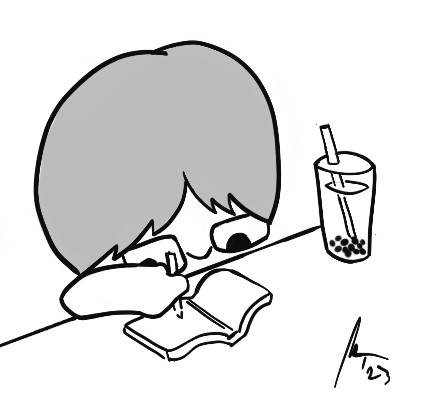
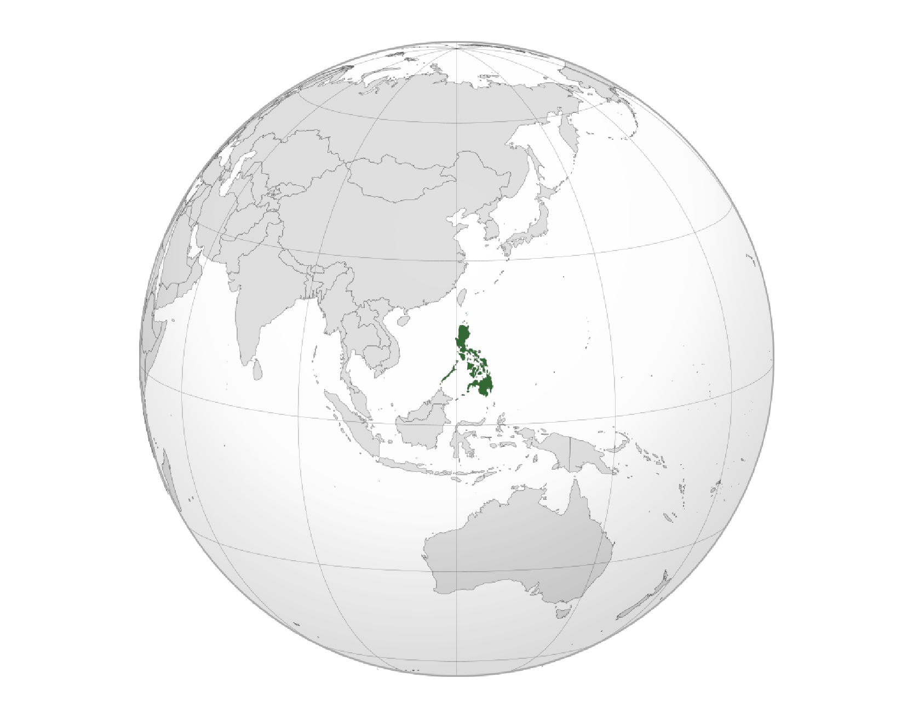

---
hide:
  - title
  - navigation
  - toc
---

<figure markdown>
  { width="300" }
  <figcaption>ahh boba tea</figcaption>
</figure>

## What (1)

I will put my thoughts, reflections, projects, etc. in this space as I take the  **[Master in Design for Emergent Futures](https://iaac.net/educational-programmes/masters-programmes/master-in-design-for-emergent-futures-mdef "weeee")** at IAAC and ELISAVA this 2023-24.  

## Who (2)
I am Emmanuelle Alcazaren Pangilinan // Minnie  
a maker, designer, animator, artist
  
My background is in Industrial Design and Computer Science  
I've worked in IT, with start-ups, with medical profesionals, with fablabs and other designers  
I highly value education, play, and sustainability  

I'm not so good with words, but I'll try

## Where (3)

!!! info inline start "I am from the Philippines(4)" 
    - an archipelago in Southeast Asia
    - around 16 hours from BCN :airplane:
    - lots of great food :shallow_pan_of_food:
    - lots of great people :people_holding_hands_tone5:
    - but also lots of problems :cry:

{ width="400" }  

## Why (5)
Statement of Purpose  

{--my purpose is to find a better purpose--}  
to push the boundaries of what i can think and do in my design practice, maybe

if you're bored, you can check out **[my website](https://minniemakes.co "weeee")**

1.  Es: Qué?;  
Tagalog: Ano?
2.  Es: Quién?;  
Tagalog: Sino?
3.  Es: Dónde?;  
Tagalog: Saan?
4.  Es: Soy de Filipinas;  
Filipino/Tagalog: Ako'y mula sa Pilipinas
5.  Es: Por qué?;  
Tagalog: Bakit?