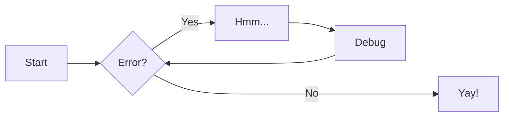

# About

<figure markdown>
  { width="300" }
  <figcaption>ahh boba tea</figcaption>
</figure>

!!! bug "This is about me"
    This is also me testing out mkdocs haha

!!! annotate info inline start "I am from the Philippines(1)" 
    - an archipelago in Southeast Asia
    - around 16 hours from BCN :airplane:
    - lots of great food :shallow_pan_of_food:
    - lots of great people :people_holding_hands_tone5:
    - but also lots of problems :cry:

1.  This is an inline info box

{ width="400" }

Text can be {--deleted--} and replacement text {++added++}. This can also be
combined into {~~one~>a single~~} operation. {==Highlighting==} is also
possible {>>and comments can be added inline<<}.

| Method      | Description                          |
| ----------- | ------------------------------------ |
| `GET`       | :material-check:     Fetch resource  |
| `PUT`       | :material-check-all: Update resource |
| `DELETE`    | :material-close:     Delete resource |

++ctrl+alt+del++

!!! info inline end "This is another note to the right" 
    Lorem ipsum dolor sit amet, (1) consectetur adipiscing elit.
    { .annotate }

    1.  :man_raising_hand: I'm an annotation! I can contain `code`, __formatted
        text__, images, ... basically anything that can be expressed in Markdown.

{==
Statement of Purpose
==}
{--my purpose is to find a better purpose--}
to push the boundaries of what i can think and do in my design practice, maybe

if you're bored, you can check out **[my website](https://minniemakes.co "weeee")**
