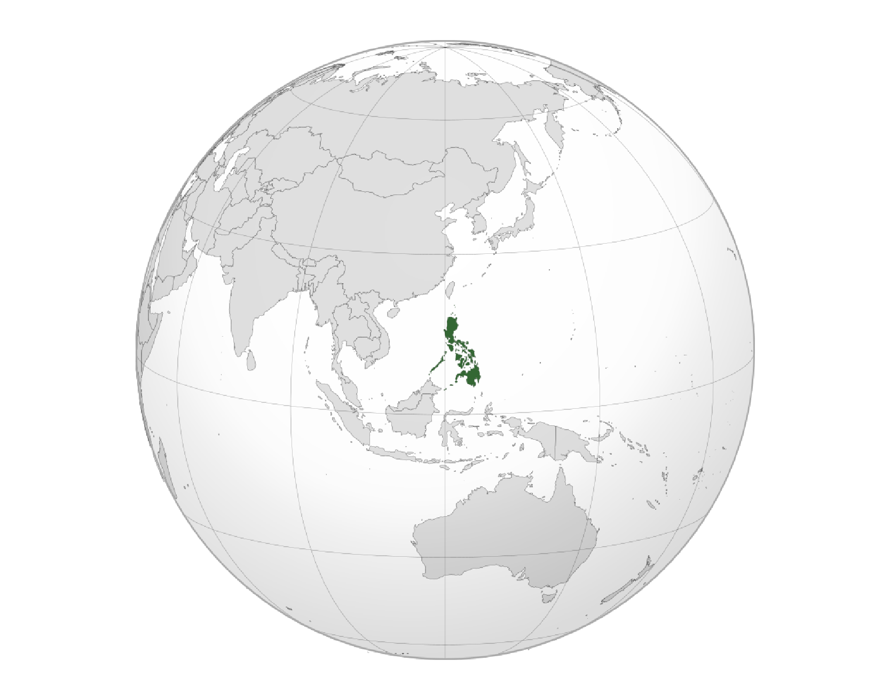

# About

  

## What :speech_balloon:

I will put my thoughts, reflections, projects, etc. in this space as I take the  **[Master in Design for Emergent Futures](https://iaac.net/educational-programmes/masters-programmes/master-in-design-for-emergent-futures-mdef "weeee")** at IAAC and ELISAVA this 2023-24.  

## Who :speech_balloon:
I am Emmanuelle Alcazaren Pangilinan // Minnie  
a maker, designer, animator, artist
  
My background is in Industrial Design and Computer Science  
I've worked in IT, with start-ups, with medical profesionals, with fablabs and other designers  
I highly value education, play, and sustainability  

I'm not so good with words, but I'll try

## Where :speech_balloon:

I am from the **Philippines** :speech_balloon:  
- an archipelago in Southeast Asia  
- around 16 hours from BCN :airplane:  
- lots of great food :shallow_pan_of_food:  
- lots of great people :people_holding_hands:  
- but also lots of problems :cry:  

  

## Why :speech_balloon:
Statement of Purpose  

<s>{--my purpose is to find a better purpose--}</s>  
(idk maybe) to push the boundaries of my design practice

---
if you're bored, you can check out **[my portfolio website](https://minniemakes.co "weeee")**