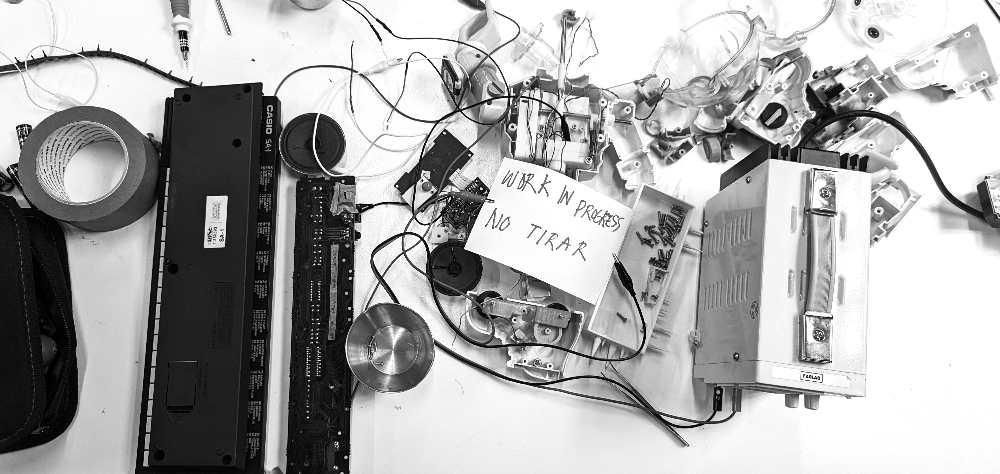
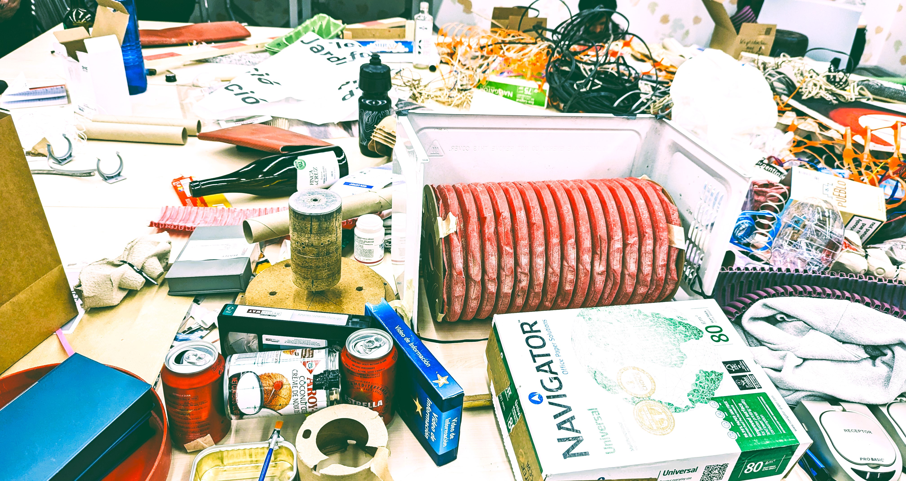

---
hide:
    - navigation
    #- toc
---

# **UNTRASHING: being in-between trash, sounds and community**
(working title)

## Research question(s):

**What does it mean to redefine our coexistence with trash for an alternative present, transitioning towards climate consciousness, waste decolonization and post-growth future? How might the interconnections between sounds, music, co-creation, climate and materials challenge the status quo?**

Untrashing is a collection of artifacts/instruments and series of activities where trash-bound/landfill-bound/ocean-bound objects are (re)collected, then transformed into musical instruments - from material landscapes into collective soundscapes. The resulting objects and sounds are presented in the final exhibition to the visitors, allowing them to also play together.

The exhibition, in MDEFest, aims to serve as meditation on the enduring legacy of discarded plastics, e-waste and rejected objects destined to become pollutants. The way waste is externalized within the predominant systems of capitalism and consumerism, has caused harm for some groups of people more than others, and it’s bound to continue for generations to come. 

Guided by the somber echoes of "kapwa" – a Filipino term for our interconnectedness with others, similar to Haraway’s “making oddkin” – Untrashing challenges conventional points of view, inviting participants to consider the profound consequences of consumptive excess and to act in resistance by focusing on care and responsibility (response-ability?) to the materiality around us.

## What we've been doing
<iframe width="100%" height="480" src="https://www.youtube.com/embed/_T0I4GzAluw?si=3Mqcpun0HOukHd40" title="YouTube video player" frameborder="0" allow="accelerometer; autoplay; clipboard-write; encrypted-media; gyroscope; picture-in-picture; web-share" referrerpolicy="strict-origin-when-cross-origin" allowfullscreen></iframe>
Making the Low-Tech Sequencer v1  
 

<iframe width="100%" height="480" src="https://www.youtube.com/embed/fB8wcn-utz0?si=s1FUowRzbG1M7V4n" title="YouTube video player" frameborder="0" allow="accelerometer; autoplay; clipboard-write; encrypted-media; gyroscope; picture-in-picture; web-share" referrerpolicy="strict-origin-when-cross-origin" allowfullscreen></iframe>
Looking back on Term 2  
 

<iframe width="100%" height="480" src="https://www.youtube.com/embed/4bKsXcgrkUM?si=GaMWHiHI86T21h8c" title="YouTube video player" frameborder="0" allow="accelerometer; autoplay; clipboard-write; encrypted-media; gyroscope; picture-in-picture; web-share" referrerpolicy="strict-origin-when-cross-origin" allowfullscreen></iframe>
Together with Nicolo and Ana, we go on adventures in circuit-bending and sound communities. Video by Nicolo.  

## La Banda del Patio x Jaleo

La Banda del Patio is a three-person group we formed in the MDEF program. We reflect on the state of the world and the state of being in it. We live in deep interconnection that many seem to have taken for granted. 

Thus, Jaleo was conceived, our final masters project and our debut public performance as a collective. Jaloe is composed of sound-making instruments that we built from second-hand flea-market objects, discarded items and ubiquitous materials. We find and create sounds in a non-linear way, in randomness and coincidence. It was all a tricky balance of taking risk while taking care. It was also lots of learning by experience, in discovering, breaking and fixing. Not to mention the explosions and smoke, we are grateful to still be injury-free.

Jaleo in Spanish can mean different things, it can mean “fuss” - as Ricky Martin’s song - or it can pertain to a type of Flamenco music. Jaleo is also reminiscent of the Tagalog word *halo* which means “mix”. For me, it encapsulates the an aspect of the project related to mixing and remixing, in the physical materiality of the objects we tinker with and of the individual ideas each of us has. 

### Punk Enough

I have been considering how this movement, our actions, fall in the category of punk. As per many things, it depends on which point-of-view we take. Looking at this as an intention of resistance against the mainstream, the powerful forces that force our daily lives to follow routines, then we can be punk.

But the history of punk as a powerful movement emphasizing emancipation and individualism must also  be considered, a community-centric approach would seem a little off. 

Perhaps we can settle in being punk enough.

### Open Jam and Performance

On the 12th June 2024, a couple of days ago as of writing, Jaleo was showcased to the public - well an audience of our own peers, the networks that we invited and total strangers who managed to find out about the event.

In the Open Jam, Nicolo made a quick speech introducing the project and invited everyone to interact with the artifacts. Anna, Nicolo and I proceeded to entertain queries and encourage people to play with the toys. It was chaotic in an organized way.

At 8pm, we did our performance, a semi-rehearsed sound composition that showcased each artifact on its own and together. Despite the panic and nerves, we, who have never played such weird instruments for a crowd before, managed to pull through. I am very proud of Anna and Nicolo. 

### Ironies we face

As much as the intention of bringing awareness to trash, we also could not avoid making trash.

As much as we want to tackle decolonization, we are bound by the rules of our former colonizers.

### Ang Pagpupugay ng Araw ng Kalayaan sa Espana

Isang bukod-tanging pagkakataon na nagkataon itong Alquimia sa anibersaryo ng Araw ng Kalayaan ng Pilipinas. Hunyo 12, 1898 ang idineklarang pagkakasarinlan ng bansang Pilipinas mula sa pananakop ng mga Kastila. Hindi ito tunay na kasarinlan pagkat ang Estados Unidos naman ang naging mananakop mula noon hanggang Hulyo 4, 1946. Masasabi rin na hanggang ngayon nasa ilalim parin ang Pilipinas ng imperyalismo - isa pang malalim at separate na talakayan. 

Kahit nasa Catalonia, na may sariling pagkakakilanlan, nasa loob parin tayo ng gobyerno ng Espanya. 

Sa nakalipas na siyam na buwan dito sa Barcelona, naka-kilala ako ng mga kapwa Pilipino, bawat isa’y may kuwento. Mga kuwento ng pagsisikap na madalas ay hindi para sa sarili kun’di para sa kanilang mga pamilya. Pagsisikap na kung hindi doble-dobleng trabaho ay tauntaong pag-iipon upang makapag-umpisa ng kanilang sariling negosyo. Mga estudiyanteng pinupush forward ang research na related sa Pilipinas.

Ang nananaig parin na sentimento ng kaginhawaaan ng buhay sa ibang bansa kumpara sa Pilipinas. Ramdam rin ang pakikipagkapwa kahit sa maliliit na paraan - sa mga kaganapan sa konsulado, grupo ng simbahan at grupo ng mga estudiyante. 

Bihira ang ganitong pagkakataon kaya’t sinamantala ko nang mag-reflect ukol dito.  Hindi man lubos na ka-ugnay sa aking proyekto, ito ay bahagi parin ng paghulma ng sarili kong practice bilang isang designer o artist.

Mahalaga ring sabihin na hindi maipagkakaila na ang kalayaan natin/ng mga Pilipino ay kaakibat rin ng kalayaan ng lahat ng napagsakupan - isa na rito ang laban ng mga Palestino kontra sa pananakop ng Israel na gawa ng suporta ng ilang malalaking bansa at korporasyon gaya ng Estados Unidos. 

Hindi tayo malaya hanga’t may kapwa tayong hindi malaya. 

### Future Plans

As MDEF ends, La Banda del Patio just begins. Driven by the connections we have formed with local and even ties with international artists, we plan to pursue the craft. We realize that there is more to discover, create and reflect upon /alternative presents/ and we shall take the chance to realize emergent futures.

## Social Media

Follow [@kotsengkuba](https://www.instagram.com/kotsengkuba/)  & [@minniemakestoys](https://www.instagram.com/minniemakestoys/) for updates 🚮