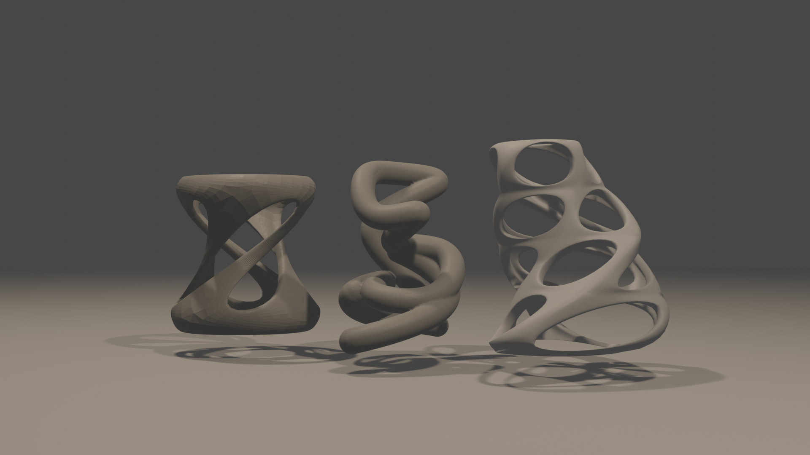
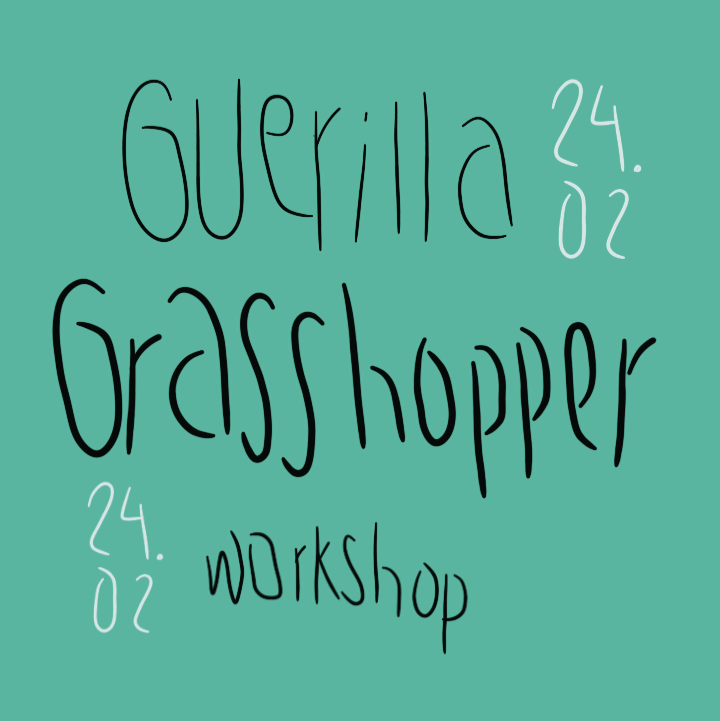
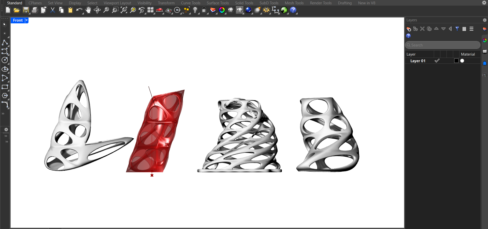
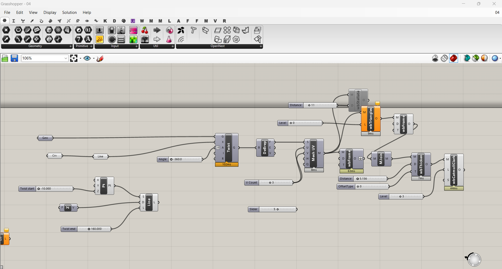

# Guerilla Grasshopper Workshops

As we didn't have any proper seminar in parameteric and computational design, some of my classmates and I scheduled our own Rhino+Grasshopper sessions ourselves. I called it the Guerilla Grasshopper Workshop. It's not really a serious workshop. It ended up with us just trying to follow a youtube tutorial (which is actually how we learn by doing!). 

Wished we had time to do more sessions but the schedule just didn't cooperate.

  

 