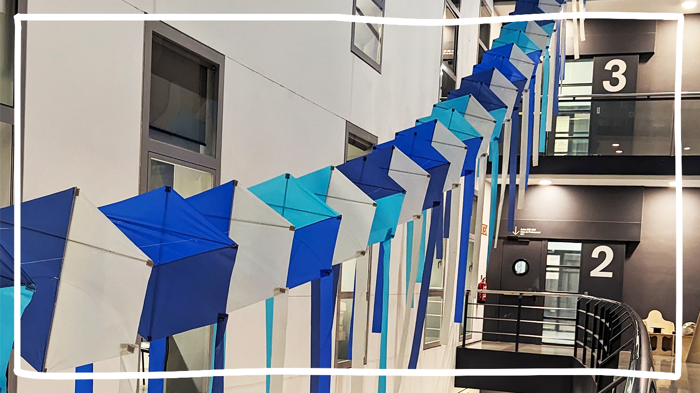
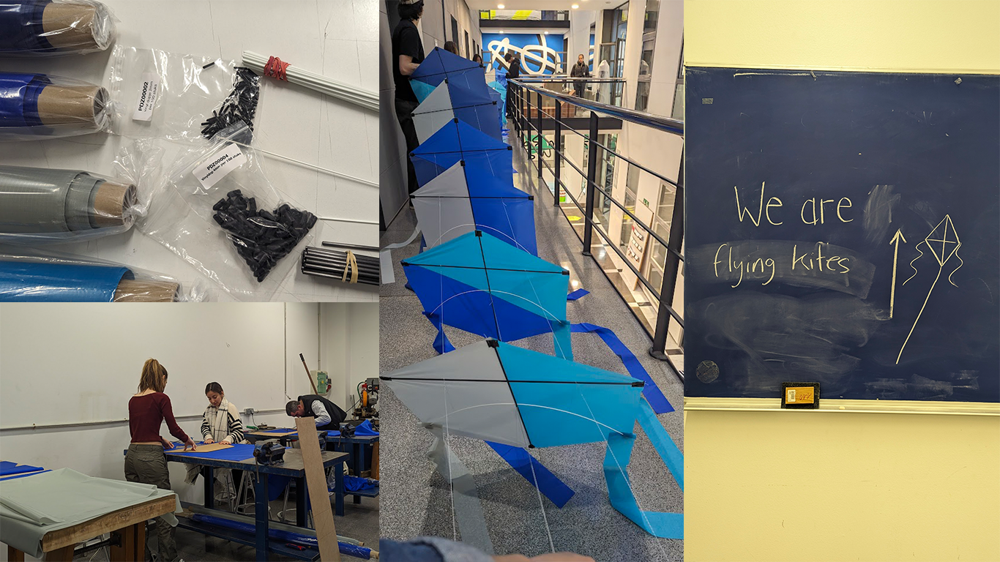

 

# Kitelab Infinite reach, Zero Weight

> An Elisava Masters' Interdisciplinary Workshop  
> 19-23 February 2024  
> [Victor Guerithault](https://www.instagram.com/v.guerithault)

Workshop with the legendary(!) Victor of Kitelab and co-participants from MDEF, Visual Design, AV Design and Product Design 🩵💙🩵

Inspired by the year of the dragon, we made a 30m long modular kite! Each module is based on the rokkaku kite, a traditional Japanese fighting kite. High quality materials were provided: spinnaker, fiberglass and carbon (rods).

We used kiteplans.org for reference and planning on posting our design soon.

 

We still have ambitious plans with this (like flying by the beach!) but for now it's showcased at the main hall. Just look up 🪁

The amazing team:
@nicolo.baldi_
@purplerain2222
@iinesace
@wip28
@lakitu_s
@olasn0g
@kotsengkuba