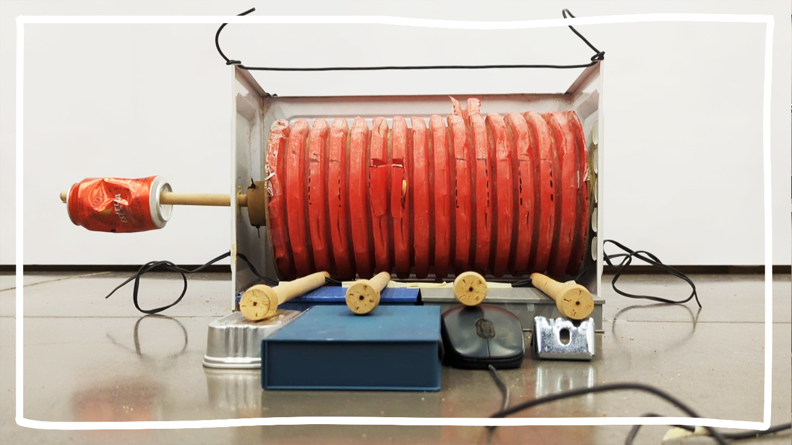
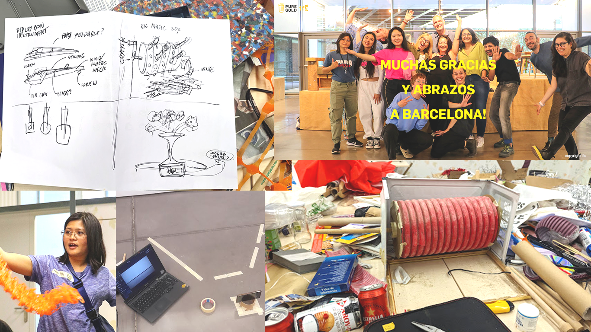

# Pure Gold Workshop

> Disseny Hub  
> 7-10 February 2024  
> [Pure Gold ifa](https://pure-gold.org/)

I had the opportunity of joining the [@ifa_puregold](https://www.instagram.com/ifa_puregold) workshop held at the Disseny Hub and got to meet fellow trash people! We shared stories and our (mostly frustrated) worldviews, we shared food, we shared our trash to create new objects. We documented our processes in stopmotion, which will soon be posted on the PURE GOLD platform so others can replicate. Thank you @lapatsch_unger 💚

Here's what I made! I call it the Low-Tech Sequencer v1 🎶 A music-box-like mechanism that turns trash into patterns of sounds. 
<iframe src="https://player.vimeo.com/video/955438211?h=c3a722aa14&color=f1d416&title=0&byline=0&portrait=0" width="640" height="360" frameborder="0" allow="autoplay; fullscreen; picture-in-picture" allowfullscreen></iframe>

<a href="https://vimeo.com/955438211">Pure Gold Upcycable No. 057</a> from <a href="https://vimeo.com/ifapuregold">ifa Pure Gold</a> on <a href="https://vimeo.com">Vimeo</a>.
