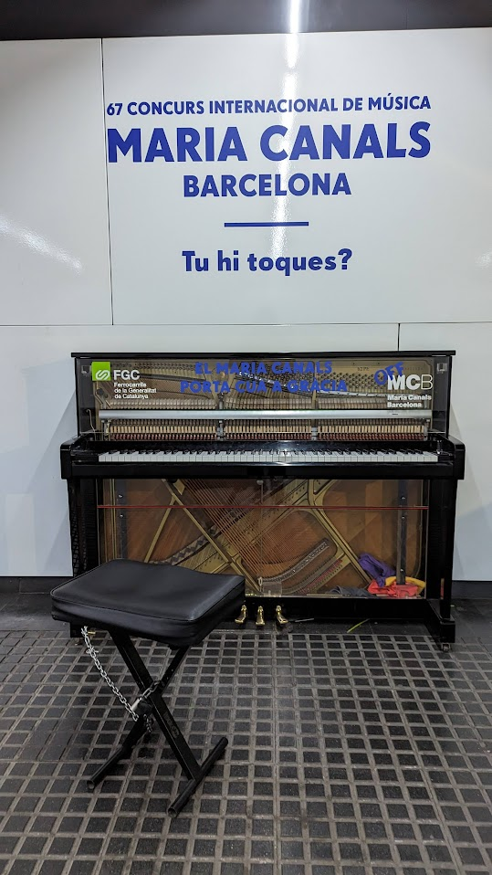
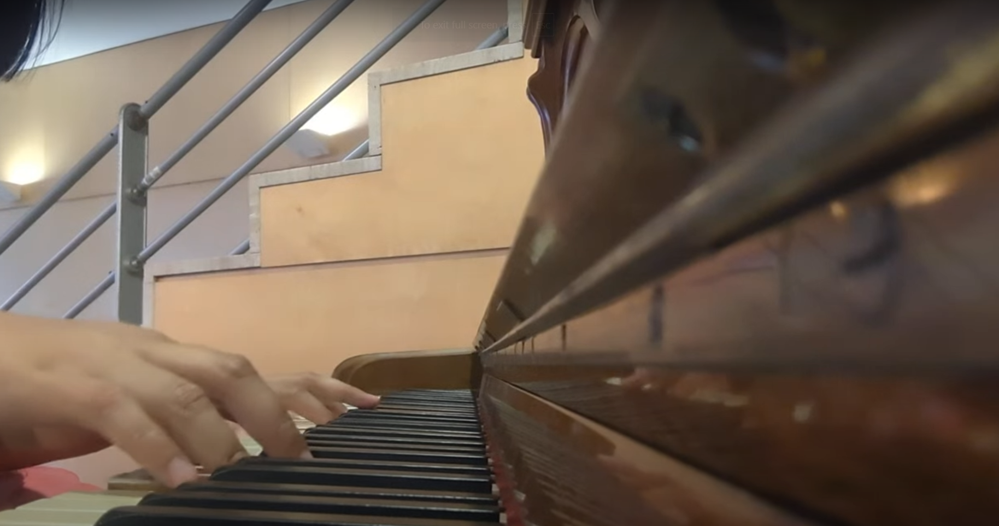
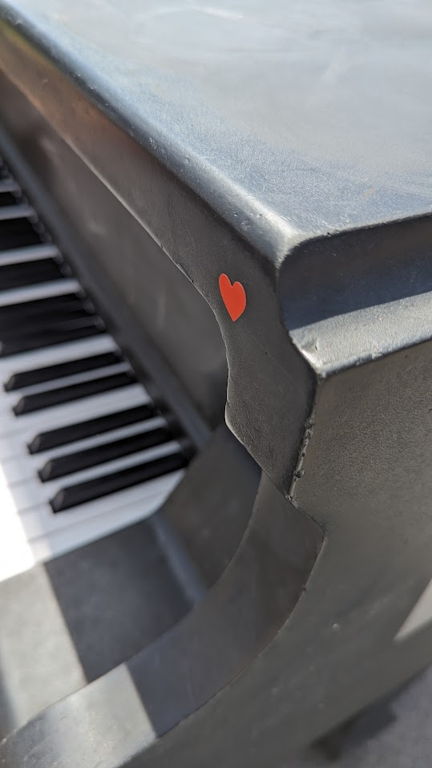
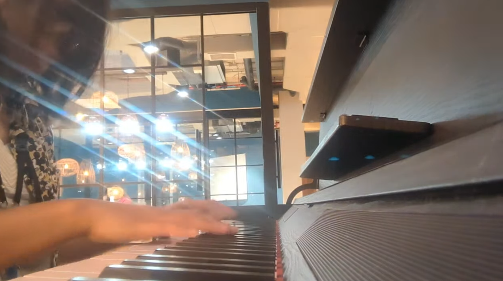
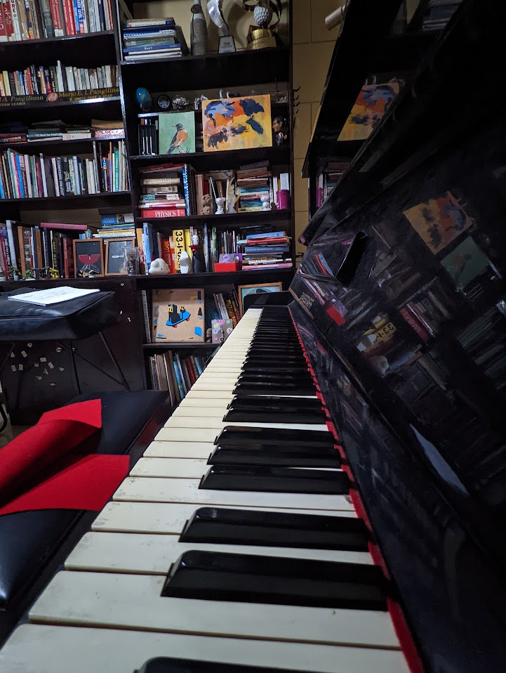
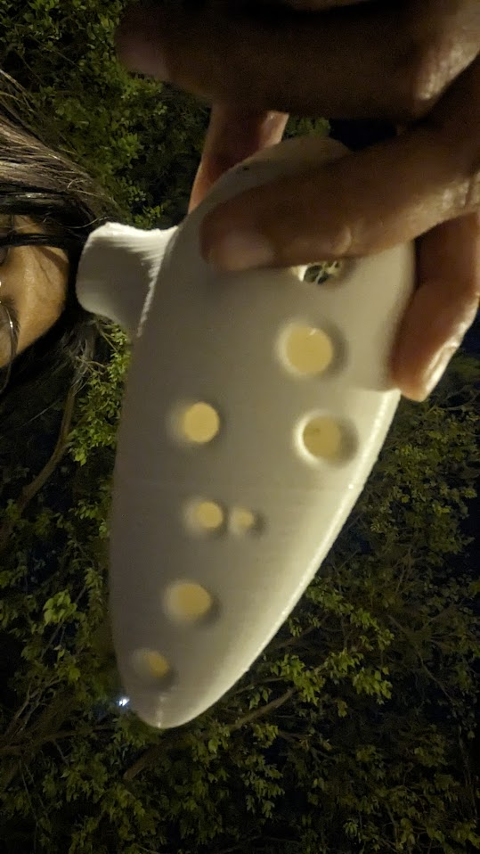

# Sonar Side Quests

## Kalimba
It was the only instrument that I could fit in my bags coming here. It's very handy and fun.  
<iframe height="480" src="https://youtube.com/embed/JrX94WV0iKo" title="YouTube video player" frameborder="0" allow="accelerometer; autoplay; clipboard-write; gyroscope; picture-in-picture;" referrerpolicy="strict-origin-when-cross-origin" style="display: block; margin: 0 auto"></iframe>

## Pianos in the City
Missing playing, I searched for public pianos, and I found some! I have also encountered people who stayed and listened, as well as other musicians who played with me. Beyond the language barriers, we found/created little moments of connection.
 

  

    

## Dinamo Espai
I am so so thankful to have discovered Dinamo. Everyone is welcome. We met new collaborators and friends! Open thursdays are the best. [Follow on IG](https://www.instagram.com/dinamoespai/)

## Agullana
Went on a spontaneous trip with La Banda + Ever to see Lolo y Sosaku and Za! // all for academic purposes haha //

## Ocarina
I 3D printed an ocarina!

## Inspirations

### Stanley Ruiz
Had a call with Sir Stan! He is one of my instructors in my bachelors in the University of the Philippines. Aside from being a star designer, Sir Stan also had/has a music career. He shared with me his experience with circuit bending and hardware hacking from more than ten years ago, so fascinating and inspirational. [Profile on the Artling](https://theartling.com/en/designer/stanley-ruiz/). 

### Mutan Monkey
Robert from Mutan Monkey was super nice and accommodating when we visited his studio, which was super cool #goals  [Mutan Monkey Website](https://www.mutanmonkeyinstruments.com/)

### Elevator Sound
In the middle of Gotico, is Elevator Sound, where we met Eric. Of course we played with their toys. [Elevator Sound Website](https://eu.elevatorsound.com/)

### Lolo y Sosaku
Amazing duo. [Lolo y Sosaku Website](http://www.loloysosaku.com/)
