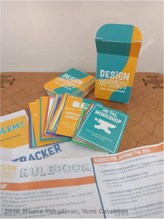
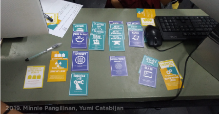

---
hide:
    - toc
---

# Atlas of Weak Signals

For most of us, the term as well as the concept are new. I first interpreted each of the words as I understood them.

"Atlas" is mapping/cartography tool. It sounds cooler than "map".

Coming from engineering, "signals" for me are more common as electronic signals. Interpreting a signal as "weak" is like fuzziness. Something that is there but unclear and perhaps hard to distinguish from others. They may also be hard to trace to the source

I also kind of visualise it at catching some unknown or mixed frequency on the car radio, where you kind of have to fine tune the knob and/or physically navigate to get stronger signal.

The work begins in looking for these weak signals from possible emergent  futures. 

## Design Space
I am unsure but it looks like Design space contains AoWS and AoWS contains the weak signals

*the ELIF: the Design Space AoWS is a mind map (?)*

## AoWS Group Activities
The first activity is involved the entire class running the "game"  for the first time. 

### Design Sprint
During my undergrad, my friend and I created a card game similar to this one. It was called "Design Sprint". Ours was focused on current and more localized context ("stronger signals"?), while the AoWS cards are more general and conceptual.

<figure markdown>
  {data-gallery="design-sprint"}
  <figcaption>2019. Design Sprint Prototype</figcaption>
</figure>
<figure markdown>
  {data-gallery="design-sprint"}
  <figcaption>2019. Playtesting</figcaption>
</figure>

## Building a Design Space

## Building MY Design Space

<iframe width="768" height="432" src="https://miro.com/app/embed/uXjVNcPeXLc=/?pres=1&frameId=3458764566367281442&embedId=871681714331" frameborder="0" scrolling="yes" allowfullscreen></iframe>
