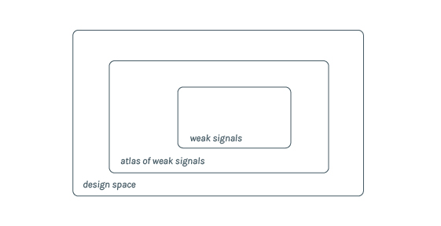
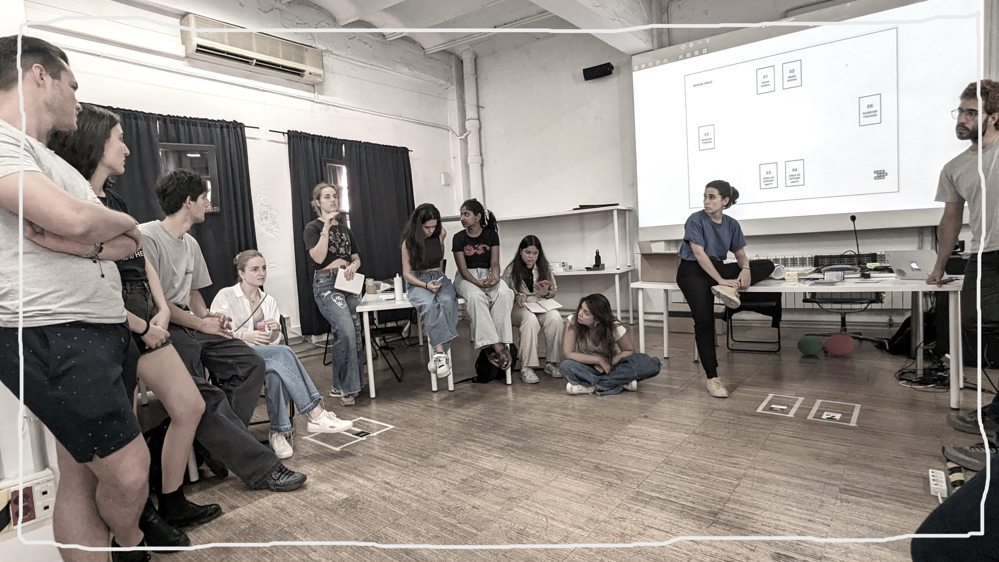
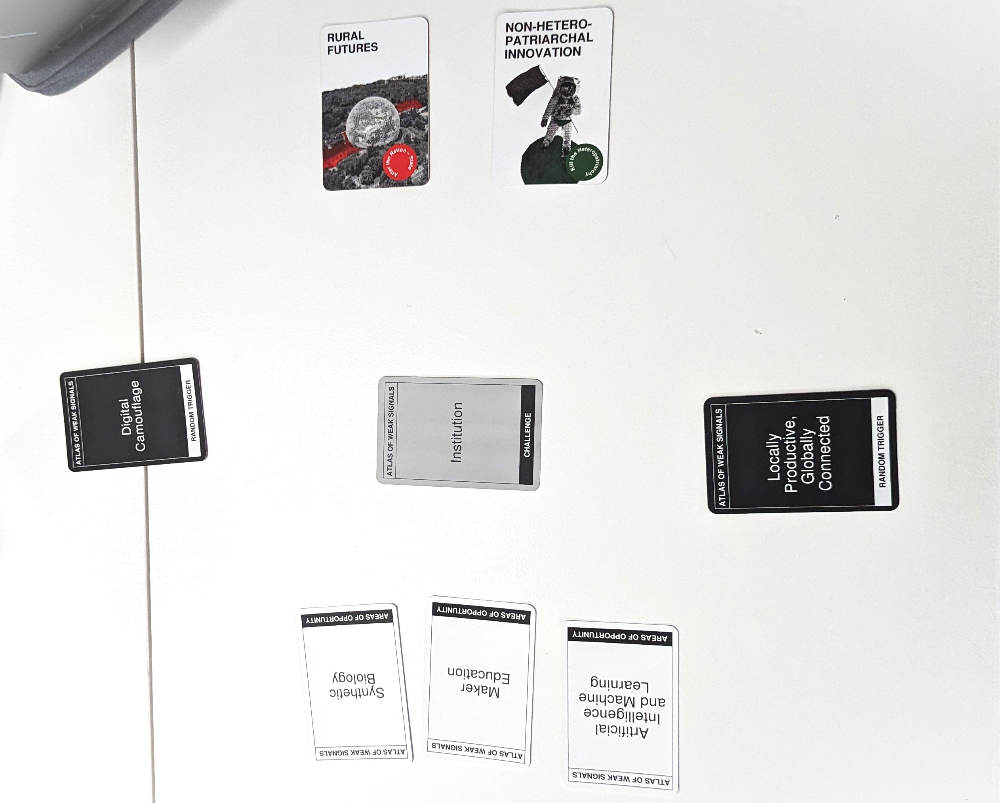
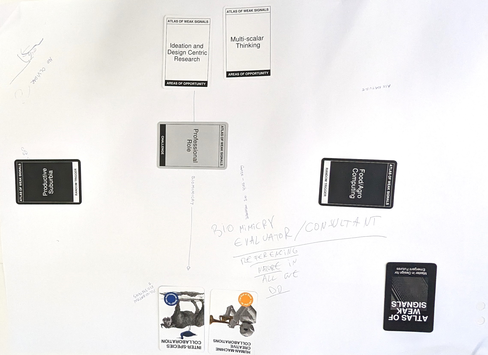
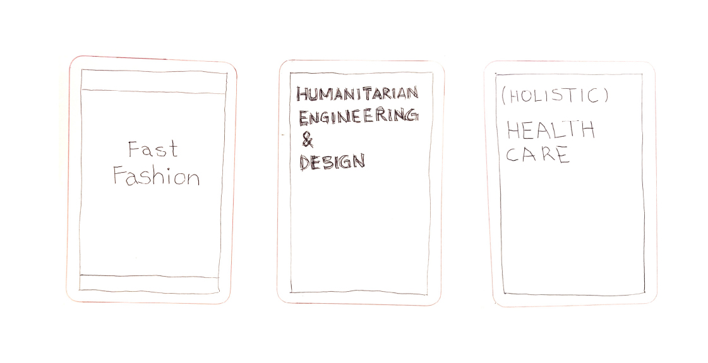
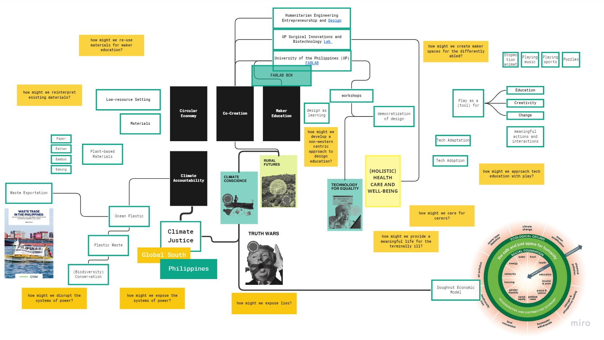
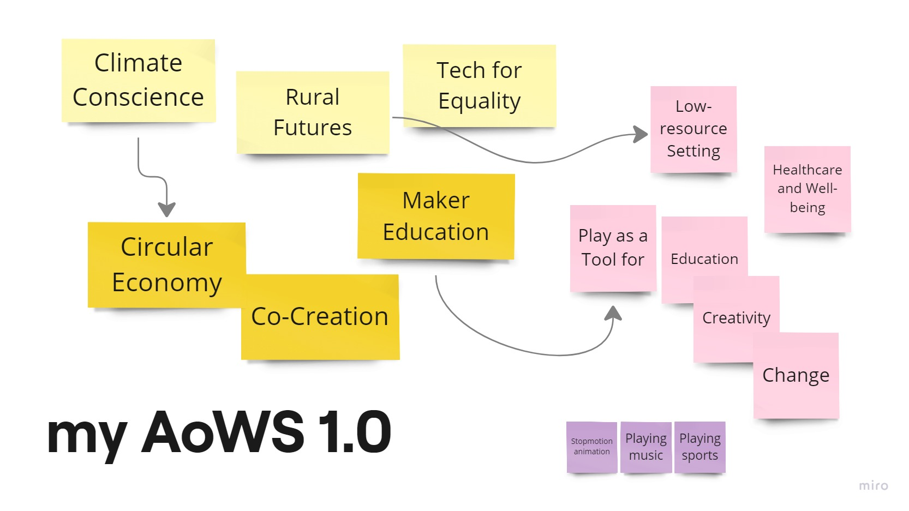

For most of us, the term, as well as the concept of "Atlas of Weak Signals", is new. I first interpreted each of the words as I understood them.  

"Atlas" is a mapping/cartography tool. It sounds cooler than "map".

"Signals" for me, coming from a computer science and engineering lens, means electronic signals. Interpreting a signal as "weak" is like fuzziness. Something that is there but unclear and perhaps hard to distinguish from others. They may also be hard to trace to the source.

I also kind of visualise it at catching some unknown or mixed frequency on the car radio, where you either have to fine tune the knob and/or physically navigate to get stronger signal.

The work begins in looking for these weak signals from possible emergent futures. 

The paper on AoWS: **[Exploring Weak Signals To Design and Prototype for Emergent Futures](https://raco.cat/index.php/Temes/article/view/373819/467375 "")**

The ongoing Atlas: **[here](https://fablabbcn.org/blog/emergent-ideas/atlas-of-weak-signals "")**

## Design Space
These tools exist in this hierarchy: Design Space contains AoWS and AoWS contains the weak signals.

*ELIF: the Design Space is like a mind map of things that might happen in the future (Weak Signals), connecting them to your own research and experience (1PP)*

## AoWS Group Activities
### Class Activity
The first activity is involved the entire class using the toolkit for the first time. 

<figure markdown>
  {width="100%" data-gallery="aows-activity"}
  <figcaption></figcaption>
</figure>
<figure markdown>
  {width="100%" data-gallery="aows-activity"}
  <figcaption></figcaption>
</figure>

### Group Activity
We then repeated the activity in smaller groups of four. 

<figure markdown>
  
  <figcaption></figcaption>
</figure>

### Suggest new cards

{width="100%" data-gallery="aows-new-cards"}

Weak Signals:  
  Humanitarian Engineering and Design,   
  Healthcare - I am unsure if Holistic is a good term for this, but basically the healthcare considering the patient as an entire person beyond the medicines and treatments, and as part of a community

Random Trigger: Fast Fashion

### Design Sprint
During my undergrad, my friend and I created a card game similar to this. It was called "Design Sprint". Ours was focused on current and more localized context ("stronger signals"?) with the goal of teaching Design Thinking by coming up with a design intervention. The AoWS cards are far more rooted in research, more conceptual and radical.  

<figure markdown>
  {data-gallery="design-sprint"}
  <figcaption>2019. Design Sprint Prototype</figcaption>
</figure>
<figure markdown>
  {data-gallery="design-sprint"}
  <figcaption>2019. Playtesting</figcaption>
</figure>

## Building MY Design Space
### Current Version
This is my ongoing Design Space. For the initial submission, I have created a board with various concepts that I am interested in. The Weak Signals included are: Climate Conscience, Rural Futures, Truth Wars, Technology for Equality. I also added Holistic Heathcare and Well-being. 

It still is a brain dump of the various issues I want to tackle. I plan to update this, adding connections and tuning in to a specific topic, as we go. 

My early concern is that, am I looking at only current and local problems, and less at emergent futures?

<figure markdown>
  {width="500" data-gallery="design-space"}
  <figcaption>1.2</figcaption>
</figure>

<iframe width="768" height="432" src="https://miro.com/app/live-embed/uXjVNcPeXLc=/?moveToViewport=386,219,966,533&embedId=833514131418" frameborder="0" scrolling="no" allow="fullscreen; clipboard-read; clipboard-write" allowfullscreen></iframe>

### Archive
**Multiscalar Personal Design Space**
<figure markdown>
  {width="500" data-gallery="design-space"}
  <figcaption>1.1</figcaption>
</figure>

**Personal AoWS Board**
<figure markdown>
  {width="500" data-gallery="design-space"}
  <figcaption>1.0</figcaption>
</figure>

