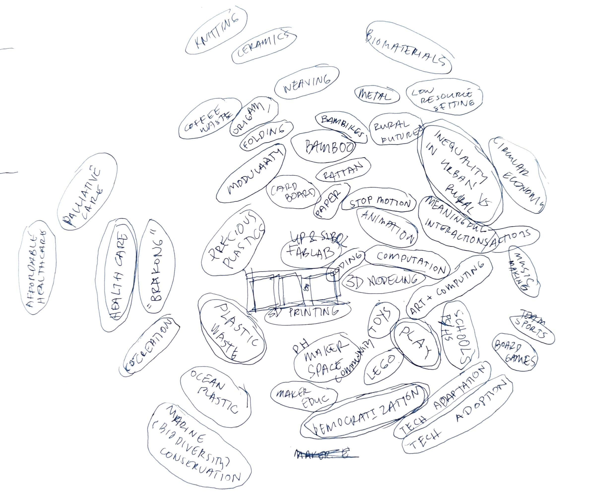

For most of us, the term, as well as the concept of "Atlas of Weak Signals", is new. I first interpreted each of the words as I understood them.  

"Atlas" is a mapping/cartography tool. It sounds cooler than "map".

"Signals" for me, coming from a computer science and engineering lens, means electronic signals. Interpreting a signal as "weak" is like fuzziness. Something that is there but unclear and perhaps hard to distinguish from others. They may also be hard to trace to the source.

I also kind of visualise it at catching some unknown or mixed frequency on the car radio, where you either have to fine tune the knob and/or physically navigate to get stronger signal.

The work begins in looking for these weak signals from possible emergent futures. 

## Design Space
These concepts/tools exist in this hierarchy: Design Space contains AoWS and AoWS contains the weak signals.

*ELIF: the Design Space is like a mind map of things that might happen in the future (Weak Signals), connecting them to your own research and experience (1PP)*

## AoWS Group Activities
### Class Activity
The first activity is involved the entire class running the "game"  for the first time. 

<figure markdown>
  
  <figcaption></figcaption>
</figure>

### Group Activity
We then repeated the activity in smaller groups of four. 

<figure markdown>
  
  <figcaption></figcaption>
</figure>

### Suggest new cards

{width="30%" data-gallery="aows-new-cards"}
{width="30%" data-gallery="aows-new-cards"}
{width="30%" data-gallery="aows-new-cards"}

### Design Sprint
During my undergrad, my friend and I created a card game similar to this one. It was called "Design Sprint". Ours was focused on current and more localized context ("stronger signals"?), while the AoWS cards are more general and conceptual.

<figure markdown>
  {data-gallery="design-sprint"}
  <figcaption>2019. Design Sprint Prototype</figcaption>
</figure>
<figure markdown>
  {data-gallery="design-sprint"}
  <figcaption>2019. Playtesting</figcaption>
</figure>

## Building MY Design Space
### Current Version
!!! note "TO DO: put the final here"

### Multiscalar Personal Design Space
<figure markdown>
  {width="500" data-gallery="design-space"}
  <figcaption>1.1</figcaption>
</figure>

### Personal AoWS Board 
<figure markdown>
  {width="500" data-gallery="design-space"}
  <figcaption>1.0</figcaption>
</figure>

