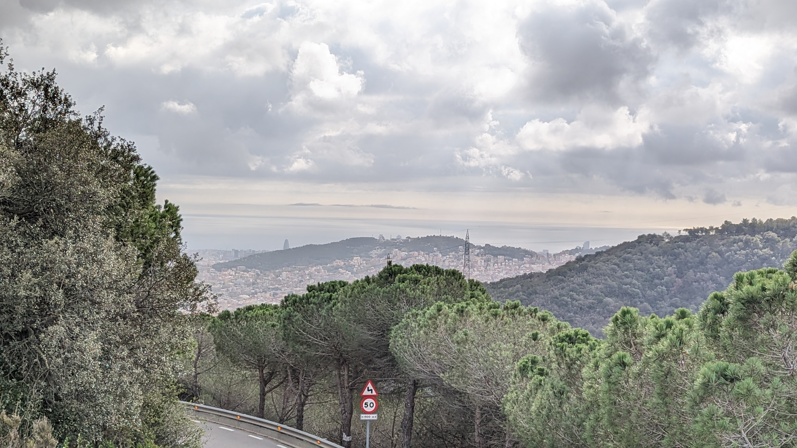

## Reflection
Have to admit, I have never been fascinated with agriculture until this seminar.  
I think one of the reasons is that, even though the Philippines is primarily an agricultural country, farming is generally perceived negatively. Therefore, it doesn't get the support it needs, economically, socially and technologically. Farmers do need more respect and dignity.

We learned about soil, seeds and plants in a hands-on manner - making it more engaging. There are also a lot of emergent technologies and methodologies that challenge our traditional ways of agriculture, mainly optimizing production to a single crop. 

Now, I am convinced that moving and designing toward rural futures is crucial.  

## Activities
### Trip to Valldaura Labs

### Essential Oils from Bay Leaves
Check out this video made by Nicolo
<iframe width="560" height="315" src="https://www.youtube.com/embed/1yX_C6PKxl8?si=Y2CZxr5E-XwRnOEV" title="YouTube video player" frameborder="0" allow="accelerometer; autoplay; clipboard-write; encrypted-media; gyroscope; picture-in-picture; web-share" allowfullscreen></iframe>

### Soil Testing
### Seeds: Rheum Australe