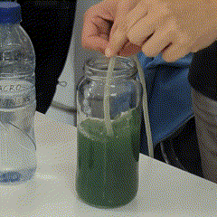

!!! warning "I was sick this week"
    I was only able to attend one class the Bio Zero week :thermometer_face: but thanks to my classmates, I am catching up. Special thanks to Carlotta and Manuja for sharing their notes!

<h1 style="text-align: center;">
a good question is good science
</h1>

This class brings back memories from my previous school because I went to a STEM school (a long time ago XD), I get  flash backs of hand-written lab reports and textbook memorization. But this class is way less boring. Science can be fun* and science is for everyone.

**Citizen Science** is open, democratized, creative, libre, shared and accessible.

In the disscussion about microbiomes and cells I learned that essentially "**Everything is proteins**" The physical 3D form of proteins determine their interactions and function.

CRISPR and genetic engineering remind me of one of my favorite sci-fi films, Gattaca. I think it was also briefly mentioned by Nuria in class. Gattaca explores the problems in a world where there are humans who are genetically "designed". 

<iframe width="560" height="315" src="https://www.youtube.com/embed/BpzVFdDeWyo?si=dT2z6krWtML3zNCw" title="YouTube video player" frameborder="0" allow="accelerometer; autoplay; clipboard-write; encrypted-media; gyroscope; picture-in-picture; web-share" allowfullscreen></iframe>
  
What happens when we exclude/discriminate at the molecular level? It's deeply concerning. We (as humanity/a "society") should stay concious of what may be the effects of these new areas we're treading.

\* As Nuria pointed out, science (in the academia) is not all flowers and happiness. Scientists are also working (currently) within systems of power that imposes control on what gets funded, what gets published, and who gets access.

!!! info "Cool and open sites"
    - [iGem](https://igem.org/)
    - [BioHack Academy](https://assets.waag.org/biohackacademy/)
    - [ENCODE](https://www.genome.gov/Funded-Programs-Projects/ENCODE-Project-ENCyclopedia-Of-DNA-Elements)

## Activities
### Growing Bacteria

{ align=left } Tho I was not present when the class prepared the petri dishes, it was interesting and a little disgusting to see what they grew. It the following days a few people were getting a bit sick, might it be because of the bodily fluids and bacteria we were growing in the classroom??  

### Spirulina
{ align=left } We got to see and taste spirulina, the new superfood! 
Spirulina is a biomass of cyanobacteria (blue-green algae) that can be consumed by humans and animals. For me, the spirulina (spread) has no taste nor smell, it's close to tofu. It's green and that may be its most off-puttng property.  

### My Designed Experiment
My proposal is about [Engineering Sars-Cov-2 and Utilizing Computational Tools to
Combat Brain Cancer](https://drive.google.com/file/d/1SxK5X1OGQcMC16fJDcrWC0a8yMAQ5Amf/view?usp=drive_link). I've chosen a realy hard and complex topic but I thought to give it a try.  
