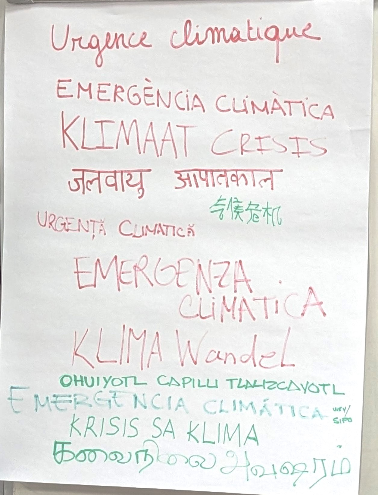
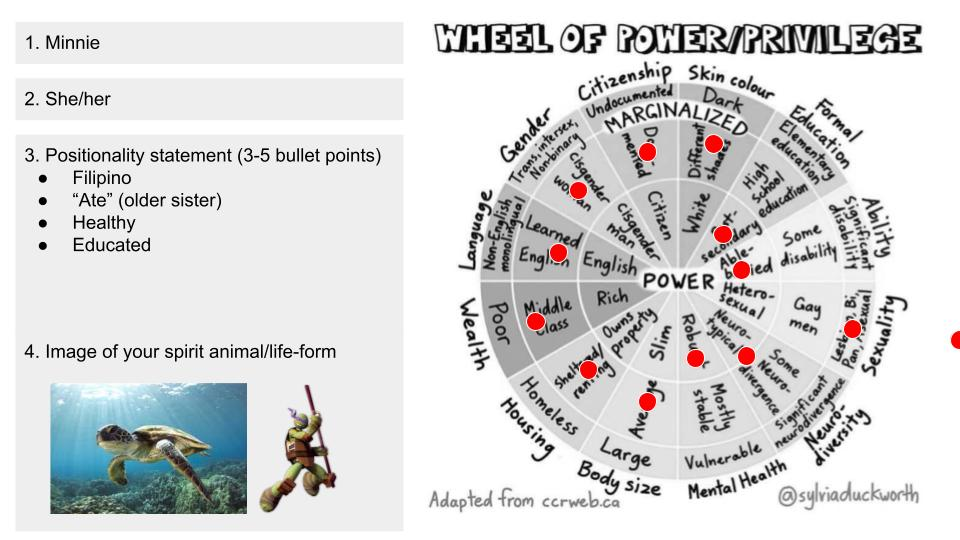

{width="300"}

It's 2024, we begin the year with this looming threat. Let's go.

!!! info "About"
    Faculty: Andres Colmenares - Founder of IAM  
    Guest: Gustavo Nogueira - Founder of Temporality Lab  
    A 4-day informative and introspective seminar about the polycrisis that we are facing today.  

## Activities
### Positionality Statement

### Fall Group
!!! info "About us"
    Members: Albert, Anna, Dhrishya, Ever, Minnie 
    Super happy and thankful for the insights, attitude and energy of each and everyone in the Fall Group 🙏

#### Day 01 Takeaways
-insert pdf-

#### Day 03 Reflections
Some of our reflections this day were:
- GDP as a measure of a country’s “growth”/status/prosperity should be changed. We should consider other parameters.
- When billionaires = new kings & queens, how do we proceed then?
- Community projects such as La Borda are needed because they *empower* the people.

#### Day 04 Solar Punk'd
We went Solar. The Fall Group headed to the beach and had conversations about the sun. We prepared questions and challenges that people could randomly pick. We figured it was a good way, a positive topic, to engage with others and bring up climate awareness, consciousness and hopefully, a little inspiration.

#### Sunset
A beautiful way to cap off the seminar
- insert pic -  

## Reflection

Designing in a state of Climate Emergency is very relevant to me and the thesis project I am pursuing. So I will be adding to this reflection as I go read up and have more ideas. My goal is to keep this page as an active, continuous reflection.

## Resources and References
