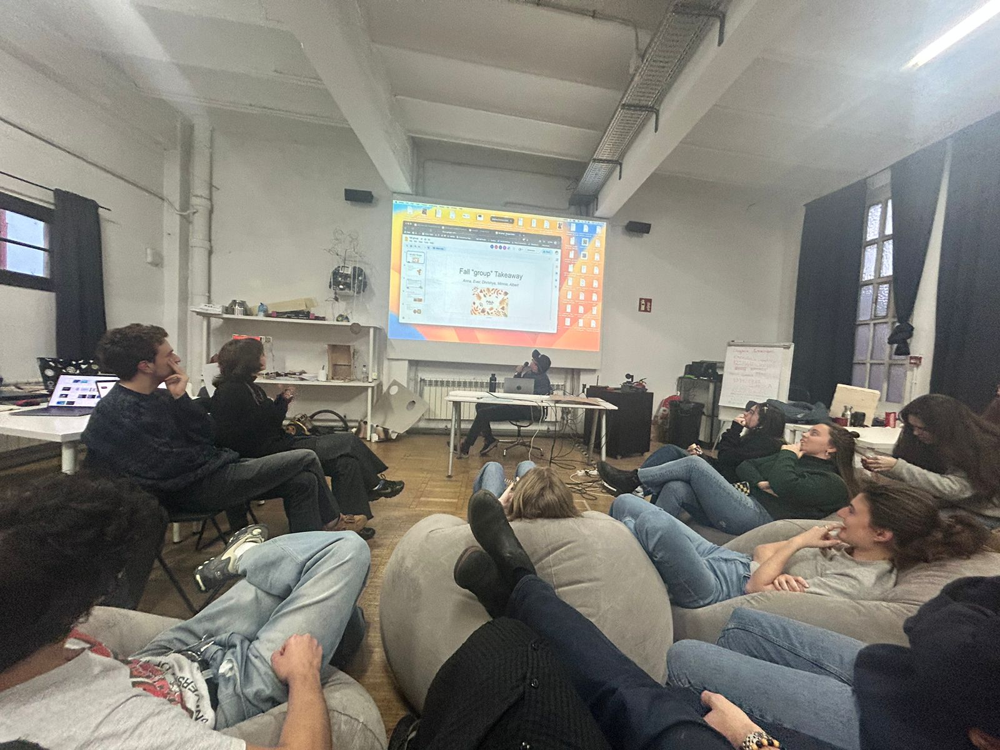
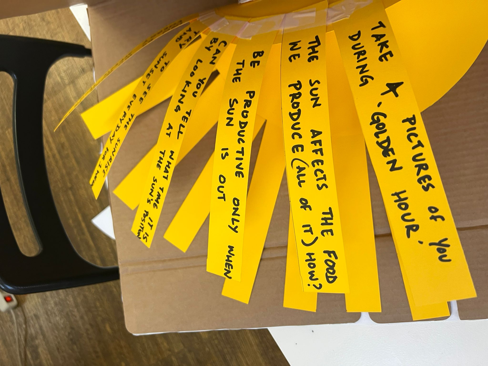
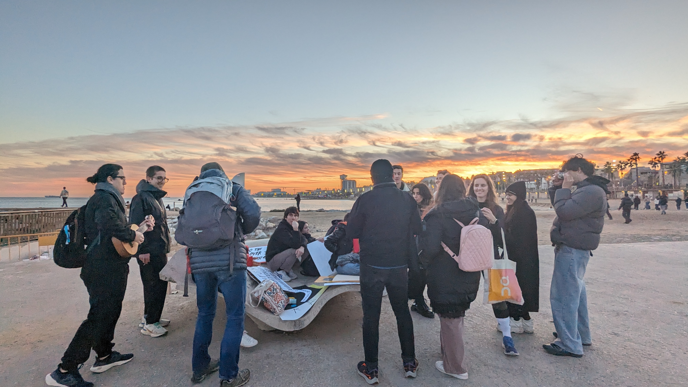

{width="300"}

It's 2024, we begin the year with this looming threat. Let's go.

!!! info "About"
    Faculty: Andres Colmenares - Founder of IAM  
    Guest: Gustavo Nogueira - Founder of Temporality Lab  
    A 4-day informative and introspective seminar about the polycrisis that we are facing today.  

### Positionality Statement

### Fall Group
!!! info "About us"
    Members: Albert, Anna, Dhrishya, Ever, Minnie  
    Super happy and thankful for the insights, attitude and energy of each and everyone in the Fall Group 🙏

### Takeaways
Some of our group reflections were:  
- GDP as a measure of a country’s “growth”/status/prosperity should be changed. We should consider other parameters.  
- When billionaires = new kings & queens, how do we proceed then?  
- Community projects such as La Borda are needed because they *empower* the people.  

<iframe width="100%" height="800" src="../../../files/fall-group-takeaways.pdf#toolbar=0&navpanes=0&scrollbar=0"></iframe>

### Solar Punk'd
We went Solar. The Fall Group headed to the beach and had conversations about the sun. We prepared questions and challenges that people could randomly pick. We figured it was a good way, a positive topic, to engage with others and bring up climate awareness, consciousness and hopefully, a little inspiration.
{width=100%}
{width=100%}
{: style='width: 50%'} 
{width=50%}

#### Sunset
We then convened by the shore and shared our experiences until the sun went down. It was a beautiful way to cap off the seminar.
{width=100%}

## Reflection
Designing in a state of Climate Emergency is very relevant to me and the master project I am pursuing. So I will be adding to this reflection as I go read up and have more ideas. My goal is to keep this page as an active, continuous reflection.

### Climate change is boring  
Designing in a state of Climate Emergency is very relevant to me and the thesis project I am pursuing. So I will be adding to this reflection as I go read up and have more ideas. My goal is to keep this page as an active, continuous reflection.

We (humans) have been talking about climate change for decades now, but the actions we (humans) take to address climate change still lags behind the (also human) forces that perpetuate the problems. It has become an old topic. It has been discussed over and over. We are tired of all these talk. Many have adapted to live more “sustainably” whatever individual capacity they can: eating less meat, using less plastic, recycling, riding bikes and trains instead of cars.  [1] 

This is the dilemma. We don’t see signs of great progress, we are also overwhelmed.

### Growth as // Pagtubo

As we go through different themes and topics in MDEF, I realized that translating them to Filipino/Tagalog allows me to look into other connected concepts and meanings. I can further investigate deeper etymologies that delve away from more “western” ideas of growth.

The tagalog root word for growth is tubo.

It is used to describe growing plants. An interesting word we find with tubo as the root word is 

**Filipino indigenous people = katutubo**

It means that the indigenous people are people who grow together (or people who grow together with plants).

## Resources and References
 1. [The climate crisis is so boring – but I also hate the idea of burning to death
 by Sofie Hagen](https://www.theguardian.com/commentisfree/2022/aug/01/climate-crisis-burning-death-meat-recycle-environment) 