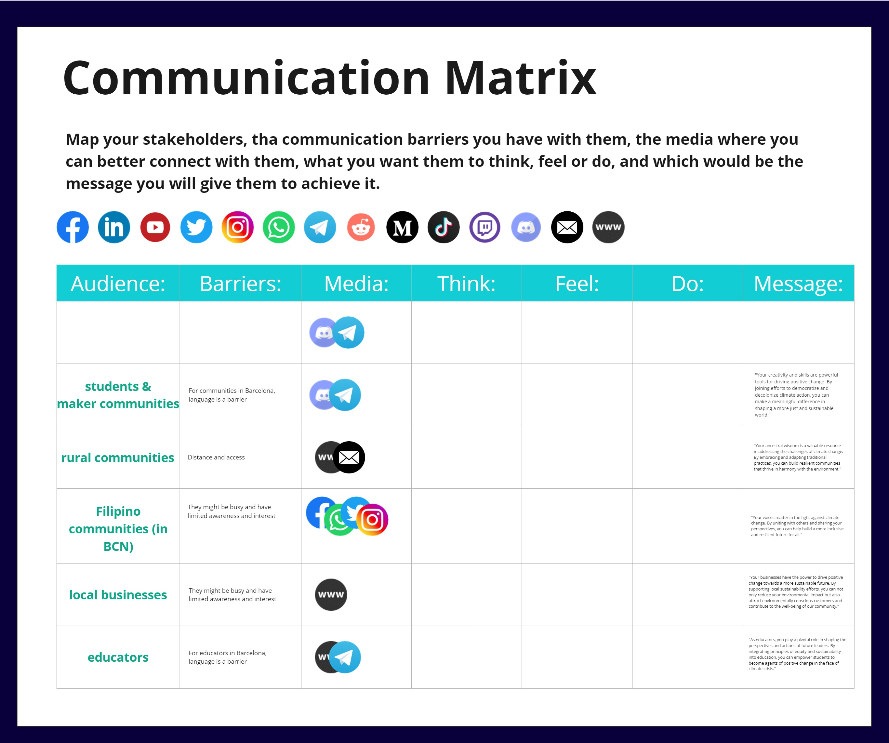

## What is my project (until now)?
I am presenting this research question:  
**How might we reinterpret our coexistence wit material waste for a transition towards a post-growth future?**

<iframe width="100%" height="800" src="../../../files/Minnie-Pangilinan-Trash-Pitch.pdf#toolbar=0&navpanes=0&scrollbar=0"></iframe>

## Communication Matrix

## Reflection
I found it really difficult to follow this seminar because defining my project is still a work in progress. Communication and writing have always been a challenging for me. It would always take me ridiculous amounts of time to even put a sentence that I am happy with and convey the ideas I want to show. (I don't even like writing.)

We had a number of activities that are supposed to guide the process. Working with Panchi throughout the term has helped in figuring out some aspects of the narrative I want to create - incorporating a sense of discovery and curiosity and creativity.

Climate change is an old issue, we (academic community, media, governments) have been talking about it for decades now. The challenge would be in creating or telling a narrative that is interesting enough to give my project a voice that people would be willing to listen to.

Lastly, I'm a bit afraid that the project personality would be a reflection of my own personality. I have to make sure that it is a more improved and presentable one.