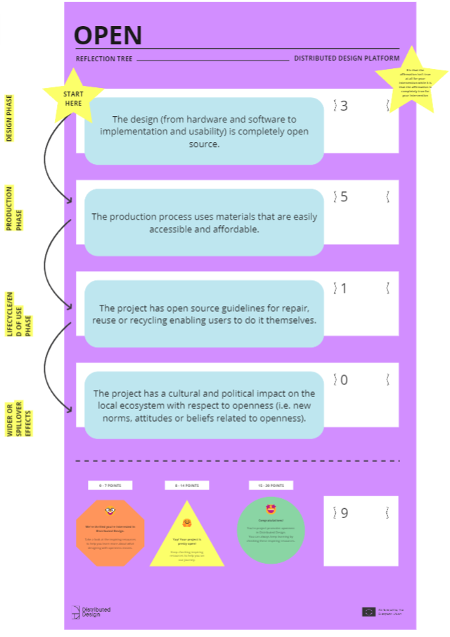
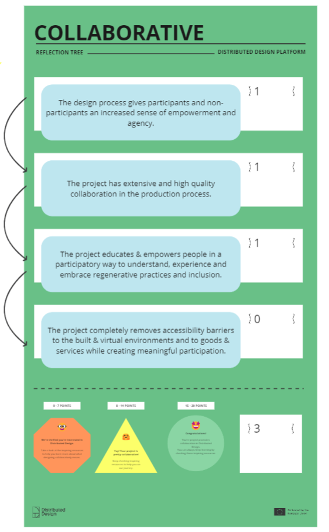
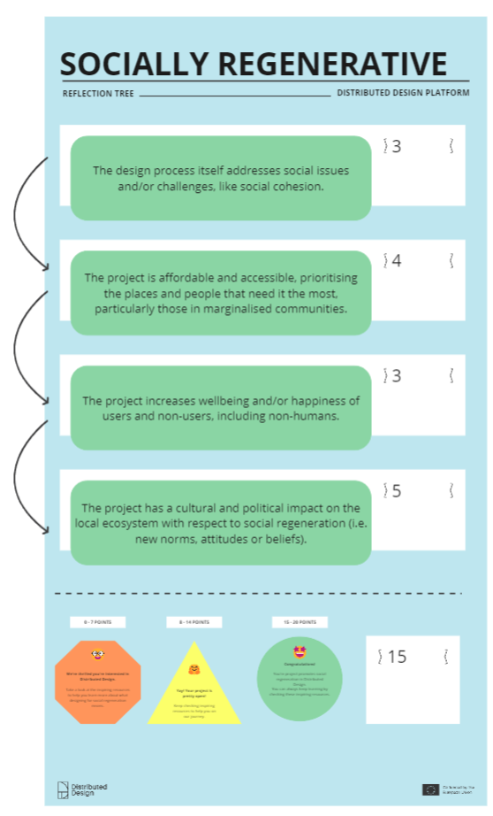
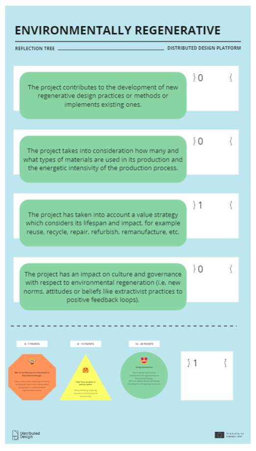
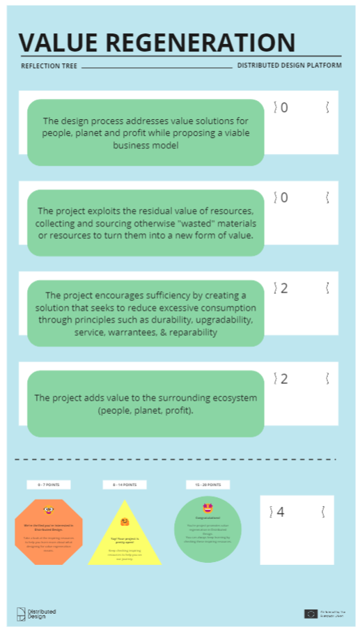
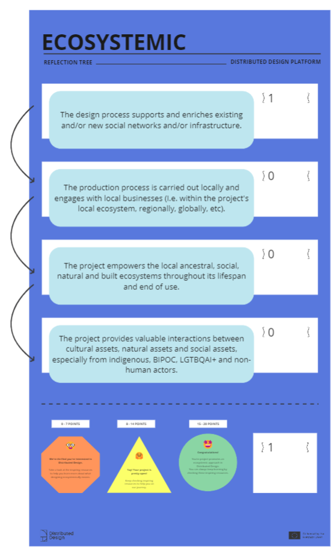
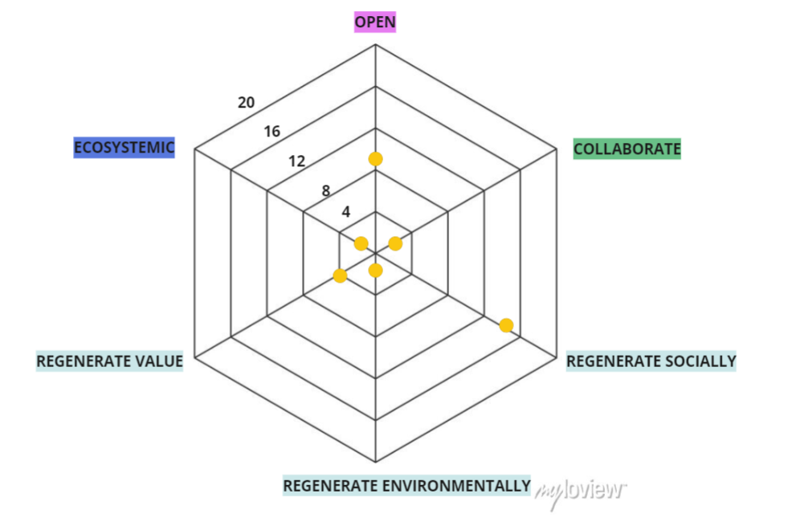

# Design with Values

!!! info "Faculty and Facilitators"
    Jessica Guy and Olga Trevisan

## Reflection Tree
From the [Reflection Tree](https://miro.com/app/board/uXjVN8fPjco=/?share_link_id=42589250457) class activity in MIRO

{width=25% data-gallery="reflection-tree"}
{width=25% data-gallery="reflection-tree"}
{width=25% data-gallery="reflection-tree"}
{width=25% data-gallery="reflection-tree"}
{width=25% data-gallery="reflection-tree"}
{width=25% data-gallery="reflection-tree"}
{width=100% data-gallery="reflection-tree"}

## Reflection
### What are the key takeaways from the activity?
- Retrospecting and Planning. I chose a previous intervention from the first term for the class activity, it was easy to evaluate because of its completion. In contrast, evaluating a future project, with a less concrete plan, is quite challenging since it could go in any way. It urges/forces one to put values at the front of mind. I think this is super important. I shall do another one for my thesis project.
- I am curious on how could distributive design approach affect at the level of policy and governance (*”The project has an impact on culture and governance with respect to environmental regeneration (i.e. new norms, attitudes or beliefs like extractivist practices to positive feedback loops)”*).
### Could you provide an open reflection on the tool *Reflection-Tree*?
- The reflection tree is an valuable tool to assess projects and interventions. It’s quantitative. It’s subjective. For ‘Value Regeneration’, it is dependent on one’s understanding of “value”.
- The (my) lack of knowledge in the material environmental impact of digital products, especially those that use AI - which we know uses a lot of computational resources to train and use, leads to an inaccurate evaluation for the environmentally regenerative criteria.
- The tool allows us to design with the complexities of the real world.