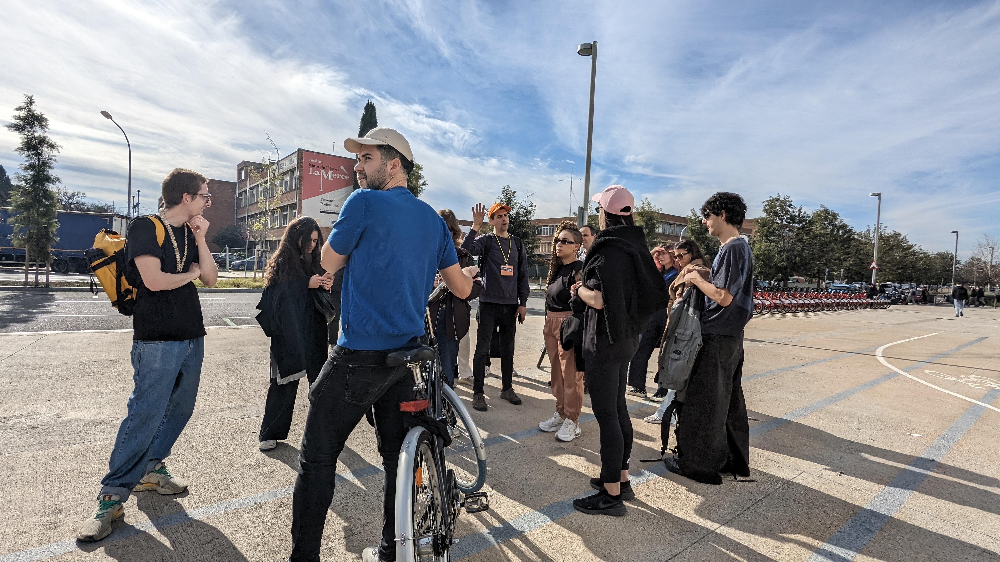
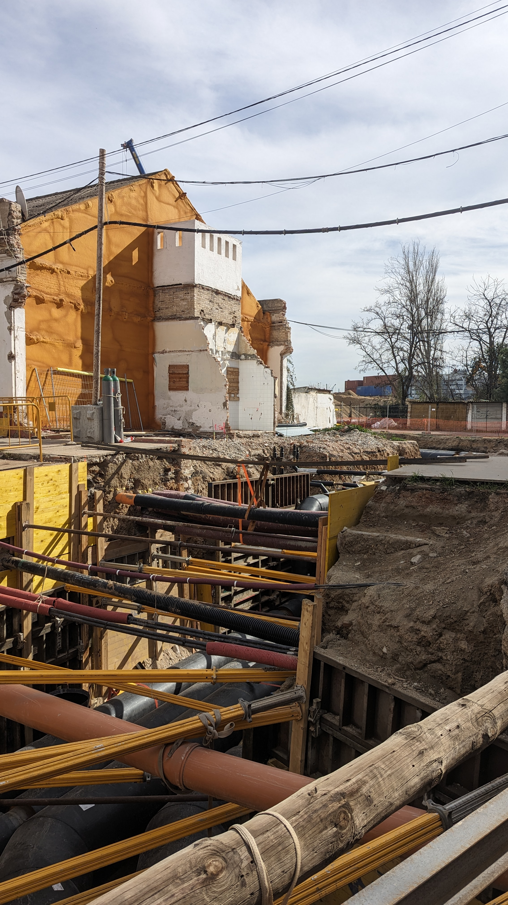
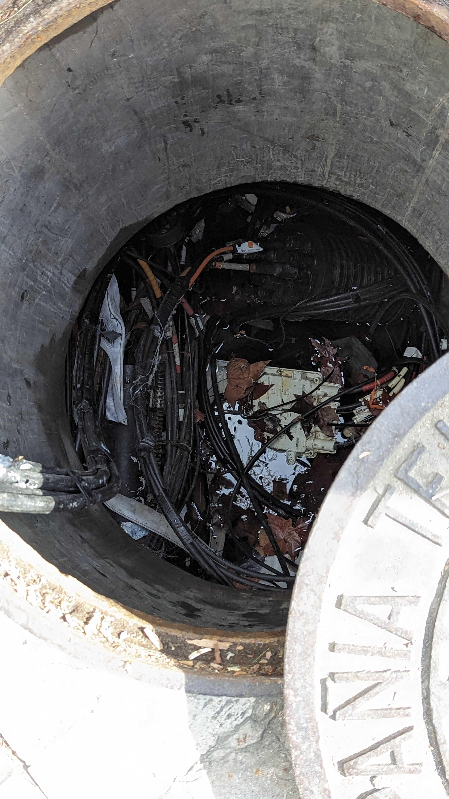

{width=100%}
## Internet Tour
The tour was a long walk where we learned about the physical structures and infrastructure that enable the internet, a seemingly virtual space. The actual experience of seeing these makes one realize that something we sometimes take forgranted actually has a toll. 

Ultimately, I was a little disappointed that we did not actually go inside the buildings of data centers. We just stood outside. ...  
{width=25%}
{width=25%}
___

{width=100%}
## Radical Situatedness
We were, once again, exposed to the different wonders of AI, the fascinating and the anxiety-inducing. 

The experience of having this activity on a patch of grass in the middle of a concrete area, while navigating the presentation deck on our phones, made it feel different that the other seminars.  ...

___

## HANGAR | Networks of Co-Responsibility
The seminar revolved around ethics and the question of: How can we establish ethical relationships between researchers and the researched (mainly non-human agents)? 

We also learned that the Wetlab still has ways to go in terms of being circular or materially sustainable. Their current practice involve evolving protocols on waste. If I am (or we were) to consider materials as non-human agents as well, might we come up with more active protocols and procedures?

