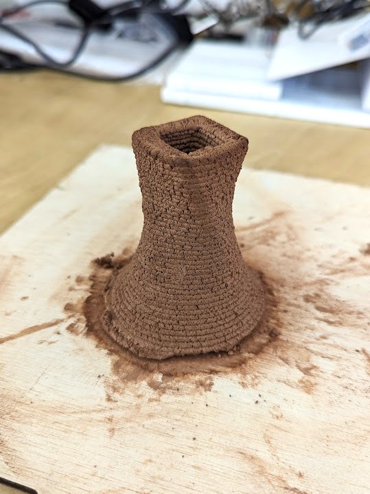

## Paste Printing with Coffee
  

Carlotta and I started the project, ideating around the themes of circularity and food waste. Because I have gotten to know the owner of a cafe I frequently  go to, we got some used coffee grounds from there and started our experimentation. 

We then joined forces with Oliver and Jorge.

Thorough documentation can be found on their pages:  
[Carlotta](https://chylkemamdef.github.io/MyPortfolio/DigitalPrototyping02.html)  
[Oliver](https://oliver-lloyd-mdef.github.io/Oliver-MDEF-Portfolio/Term%202/03.%20Digital%20Prototyping%20for%20Design.html)  
[Jorge](https://jdlm92.github.io/MDEFsite/term2/05-Digital-Prototyping/052-Circular%20Coffee/)

## Reflection
The beauty of having the 3D printer mod design and manual available online makes paste printing quite accessible. Thanks to all the folks here at the FABLAB who published the [documentation](https://github.com/fablabbcn/aei-kit-impresion-pasta).

Paste printing has a lot of potential, but as we’ve experienced, there were a lot of problems encountered in the process. I am unsure if the solution is a redesign in the material components of paste printing or the workflow.