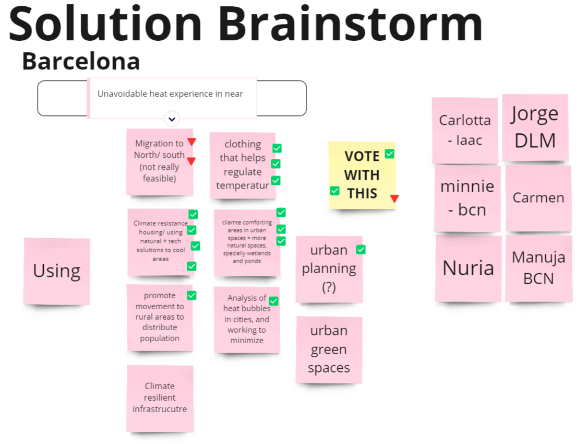
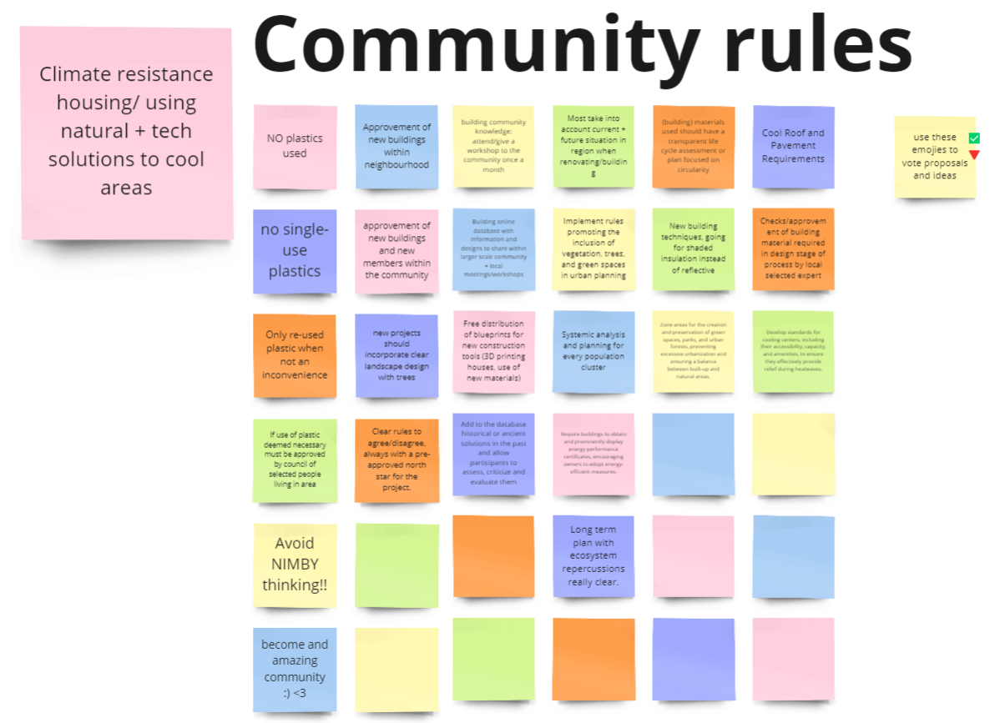
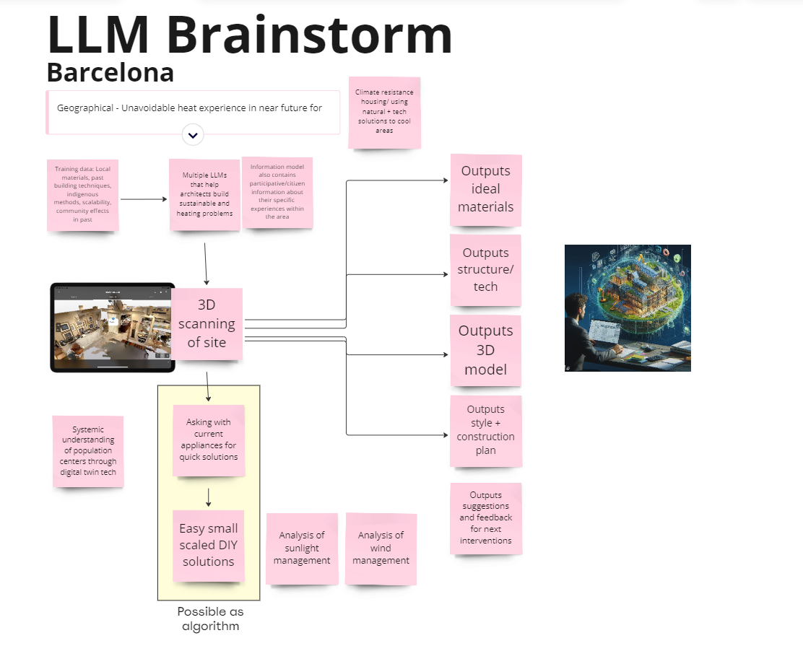
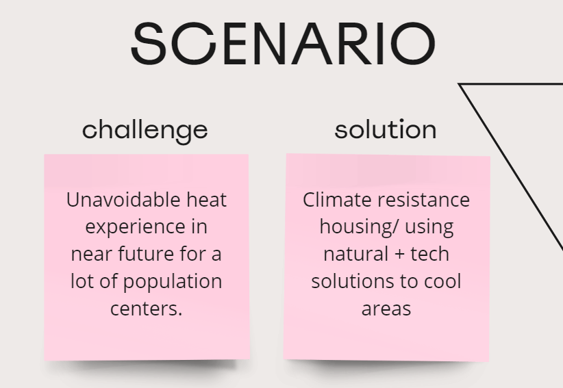
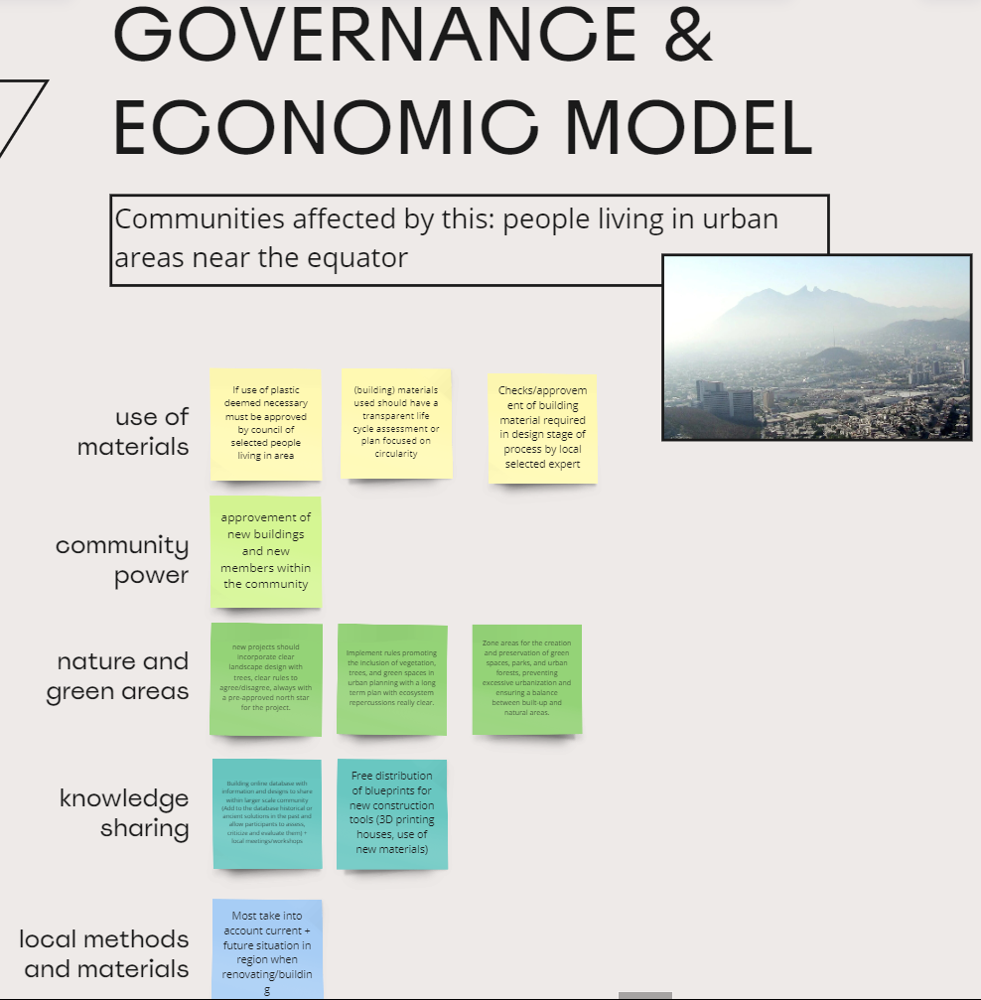
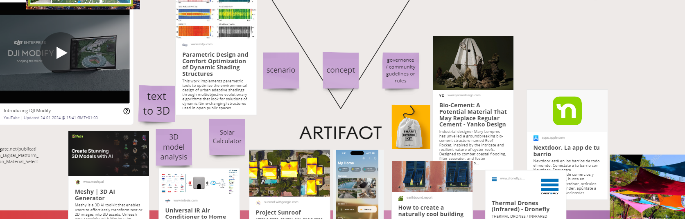

# Fair Future(s) | Designing with Collective Intelligence

!!! info "Faculty, Facilitators, Guests"
    Jessica Guy  
    Olga Trevisan  
    AX Mina  
    [from Manchester Metropolitan University]

### QUÉ CALOOOR!

!!! info "Team"
    Minnie, Carlotta, Jorge DLM, Manuja, Carmen, Nuria

<iframe width="560" height="315" src="https://www.youtube.com/embed/A8hRgg31NVM?si=wygktPzX4casmkFQ" title="YouTube video player" frameborder="0" allow="accelerometer; autoplay; clipboard-write; encrypted-media; gyroscope; picture-in-picture; web-share" allowfullscreen></iframe>

{width=30% data-gallery="quecalor"}
{width=30% data-gallery="quecalor"}
{width=30% data-gallery="quecalor"}
{width=30% data-gallery="quecalor"}
{width=30% data-gallery="quecalor"}
{width=30% data-gallery="quecalor"}

#### What is the challenge you address?
The EcoToken Community Initiative (ETCI) addresses the urgent challenge of climate change, specifically targeting energy inefficiency in residential heating and cooling. This is a crucial issue as domestic energy consumption significantly contributes to carbon emissions and environmental degradation. The challenge lies not only in reducing energy consumption but also in fostering community engagement and responsibility towards sustainable practices. Another key challenge is integrating innovative technology in a manner that is accessible, transparent, and incentivizes positive behavioral changes related to energy use.

#### What solutions are you proposing?
ETCI proposes a multi-phased solution combining blockchain technology, smart devices, and community-driven governance. The initiative starts with the distribution of EcoTokens, a digital currency that rewards eco-friendly practices. Integrating blockchain-enabled smart thermostats allows for efficient temperature regulation and energy consumption tracking. The use of blockchain ensures data transparency and security, essential for trust and accountability. Moreover, the formation of local DAOs empowers communities to collectively decide on larger sustainable interventions, such as building upgrades. This approach not only incentivizes individual actions but also promotes collaborative decision-making and resource allocation for broader environmental impact.

#### App Proposal
<iframe width="560" height="315" src="https://www.youtube.com/embed/Ktfw_9uRXoQ?si=ycJSBVDjP0xK-Rh8" title="YouTube video player" frameborder="0" allow="accelerometer; autoplay; clipboard-write; encrypted-media; gyroscope; picture-in-picture; web-share" allowfullscreen></iframe>

### Reflection
As someone with training in tech and programming and background knowledge of blockchain and NFTs, I tend I look at new tech with very curious but logical view. Maybe a bit different than your average design student.

AX Mina's lecture/segment on technology and the magical/mystical perspective for me was the most valuable as it presents a new way to look at technology. I related a lot with the parallelism with the "duwende", in the Philippines, duwende is a mythical creature, a dwarf that lives in small mounds of soil and at the bottom of trees. We then would say a small chant "tabi-tabi po" when we go into forests or areas that we think a duwende might leave, to ask permission to use the space. It is out of both fear and respect of the unknown. And it makes me more aware now if we should approach emerging technologies in a similar way. 

The NFTs lecture were a bit basic, so they were not new and that much exciting to hear. I was interested in DAOs but I got a bit lost in the presentation. I would read up on them more if/when I find its relevance to my thesis project.