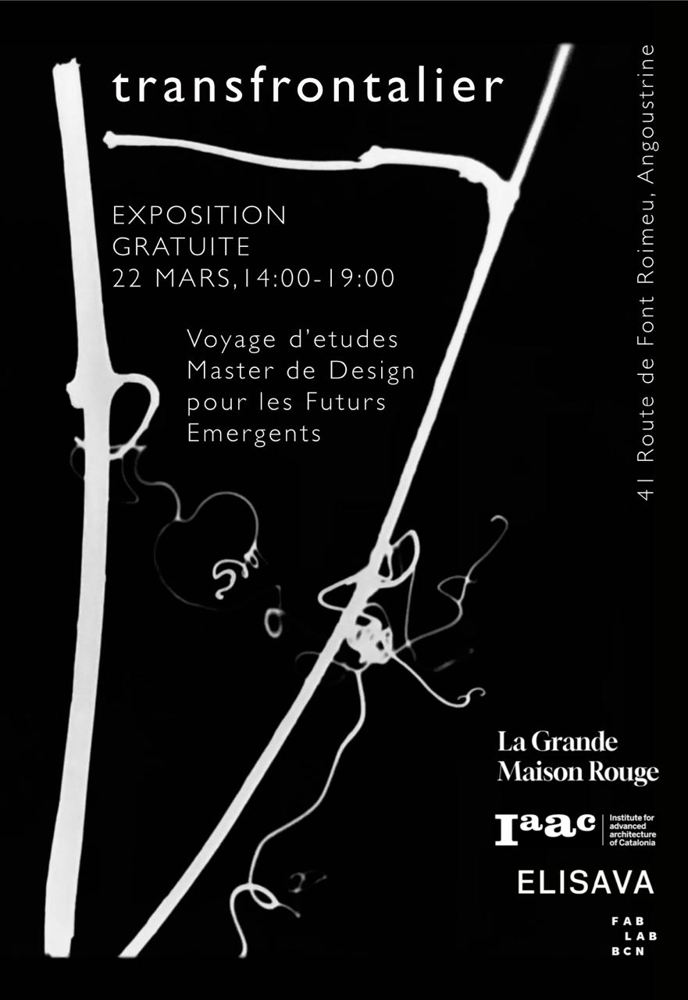
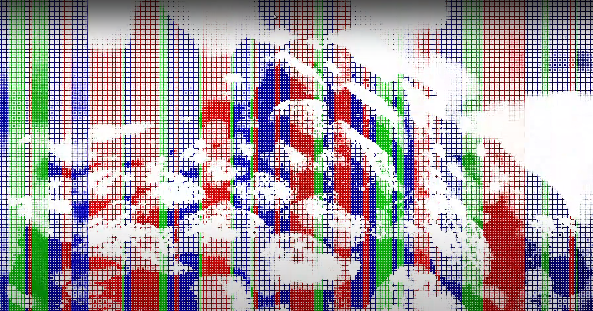

{width=50%}

For the transfrontalier, our research trip exposition, I presented Playing with Pixels.

Taking inspiration from snow, our jam sessions, nature and the interactions between the real and digital, **Playing with Pixels** is a program that displays a live video stream, from the webcam or wirelessly from a smartphone, and produces sounds, as a MIDI controller, based on how “green” the video is. The idea was to play with the camera, to explore and find nature (very simplistically represented as the green of the RGB value), so that it creates melodic sounds. These melodic sounds were tuned in the same musical scale as my kalimba, creating another opportunity to jam.

As I was coding the app and playing around with the visualization, I accidentally made it like snow was slowly building on each video frame. I kept this cool❄️ effect.

[video]
