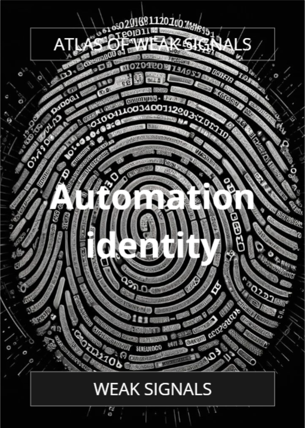

The AoWS cards were developedin the early days of the MDEF program. A lot has changed since hence the necessity to update the cards.

Our group, with Albert, Dhrishya and Flora, tackled the theme of "Biological" initially. We discussed various interests, "content", publications that we found as emerging.

We have reached a conclusion that is: What is becoming more and more apparent within the polycrisis is the interconnectedness of things (surprise surprise). While it is / can be common sense to propose more conscious ways of living, it is a powerful concept/signal that we felt is valuable to the deck. 

After the class designed our proposed card and we proceeded to map  them in an embodied activity.
<iframe height="480px" width="100%" src="https://youtube.com/embed/vtwAoRJgv_o" title="YouTube video player" frameborder="0" allow="accelerometer; autoplay; clipboard-write; gyroscope; picture-in-picture;" referrerpolicy="strict-origin-when-cross-origin"></iframe>

These are the cards we created:

## Reflection
It was a mentally draining day, the future is such a huge thing to think about. Nevertheless, the discussions, both in the smaller group and with the class, were interesting. Personally, coming from the Global South, I advocate and strive to seek for emerging developments within the themes of climate justice and decolonization.

In the midst of the current polycrisis, we can't help to have a bleak vision of the future. Guided activities like this seminar, that facilitates with empathy and openness gives us (or me at least) some hope. And I hope we have produced something valuable for the future users of the Atlas of Weak Signals.