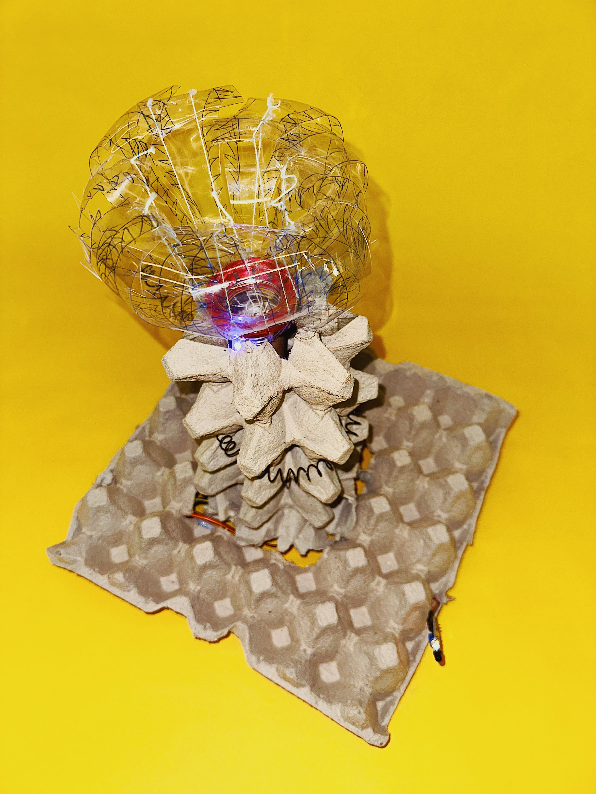

## Coral 33

For the third and final Microchallenge, I've teamed up with Dudu.

Here is our [repo](https://github.com/33dudu/MicrochallengeIII)

## Reflection
- Coinciding with the Pure Gold Workshop, I have fully exhausted myself this week. Multiple things were happening: 1. Ana, Nicolo and I have recently decided to group together for a thesis related project, therefore I was also learning circuit-bending as they were working on Valentino 2. as a participant in the Pure Gold workshop, I had my own project, separate from the one that we asked Santi to consider for this microchallenge.
- 33 is the brainchild of Dudu and together we brought it to life
- It was fairly straight-forward for me, as Dudu has a solid idea. Making the mechanics and code work in the short periods in between the workshop was the most challenging part.
- In the end, I am happy to see results of the overtime work I have gotten myself into - 33 presentation went well, the workshop led to me connecting with individuals with similar care for waste and I presented my Low Tech Sequencer, we were a small part of the exhibition at Disseny Hub, and last but not the least, I am proud of Ana and Nicolo’s work on Valentino! I did try to keep updated on their progress and process.
- In the end, these microchallenges can become unrealistically demanding of energy. And because these are paired activities, and the theses are can be individual, compromises have to be made, and it might end up not as helpful to one’s project as expected. The final presentation/feedback session is great. Although it takes a long time, it forces us to wrap up our projects nicely. I am always happy to see everyone’s work.