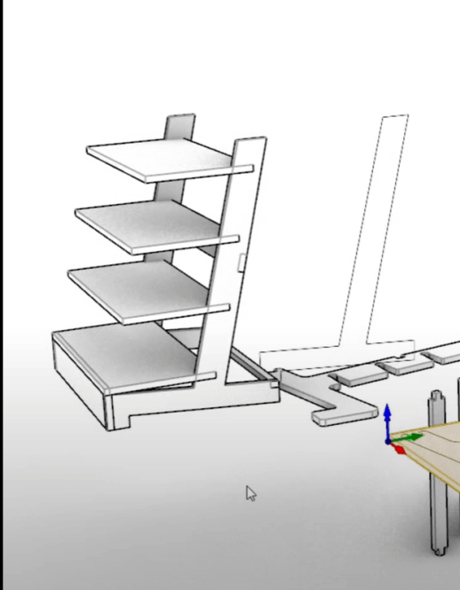
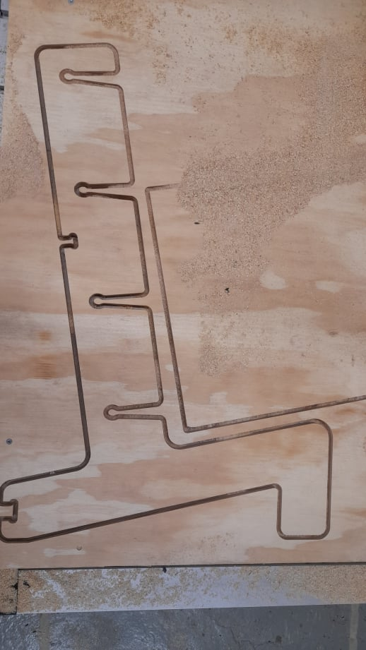
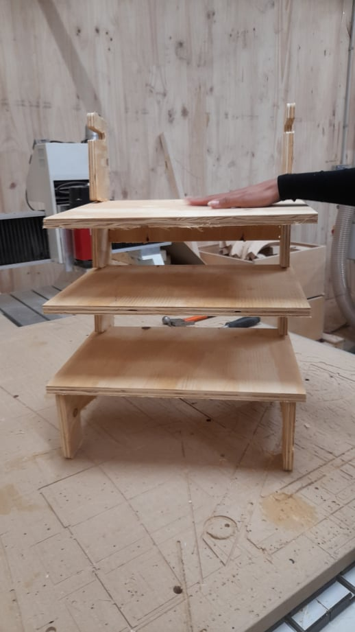
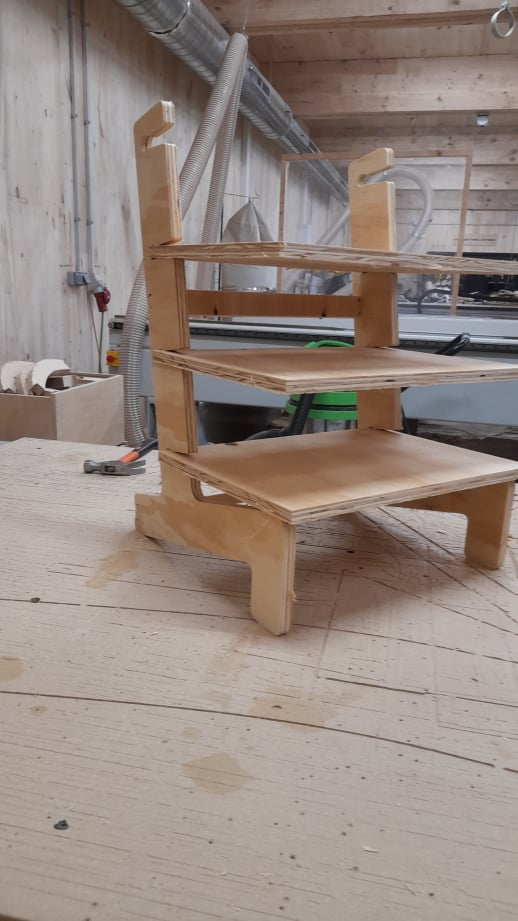

Panchi and I created a shelf for storing the little items we have in class. First, we selected a design from a reference, then we created the cutting file. We needed the help of Josep for adjusting the tolerances and generating the gcode. The CNC time was round 1 hour.

It cut everything well and the pieces fit in properly, aside from some sanding, it is ready to use. The shelf is designed to have removable surfaces, and we were thinking that the surfaces can be replaced with recycled sheets.

## Reflection

As both Panchi and I have experience using a CNC before this masters and we could only use the wood stock that was given, we were not super excited for this task.  I wanted to try it with some of the plastic sheets we made or were available in the lab.