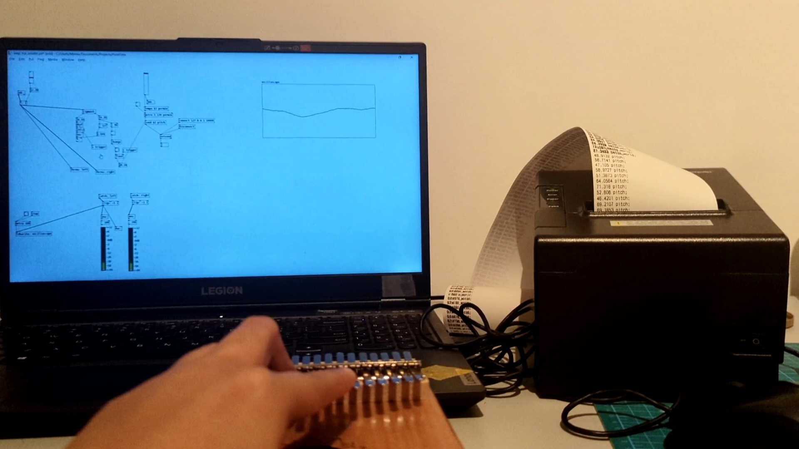
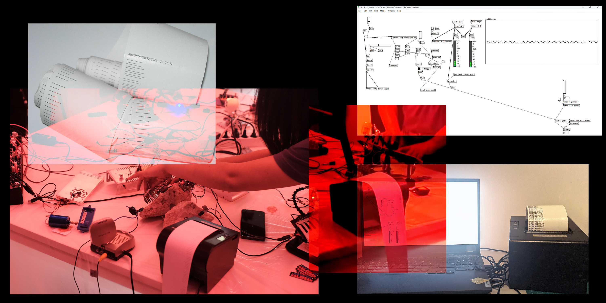

  
<iframe width="100%" height="480" src="https://www.youtube.com/embed/Wuq92poDpzo" title="YouTube video player" frameborder="0" allow="accelerometer; autoplay; clipboard-write; encrypted-media; gyroscope; picture-in-picture; web-share" referrerpolicy="strict-origin-when-cross-origin" allowfullscreen></iframe>

For the Modules 4 and 5, we made a thermal printer audio reactive such that it listens live from the microphone and prints whenever the audio is loud. Modules 4 and 5 was the opportunity to explore signal transmission and processing. Although they introduced MaxOSC, we switched to Pure Data because it is fully open source and we were more interested in working  with audio.

### How it works? 

Two applications run in parallel: a python script and a patch in Pure Data 

The Pure Data code/patch reads audio input from the microphone. There are a few controllable parameters including one that sets the loudness threashold. When the threshold is reached, the program sends a tcp message with the estimated frequency/pitch of the sound (beforehand, there is a setup of opening and connecting to the tcp port)

The python script receives the tcp messages and triggers the thermal printer to print a lines relative to the received values.

### Files
[Github repo](https://github.com/minnie-at-iaac/audio-reactive-thermal-printer/tree/main)

### Reflection

I was really motivated to create this because I like learning how to work with audio and sound and how can we make interfaces that connects with the real world with tangible objects. It was also interesting to see it work with the entire Jaleo project.

